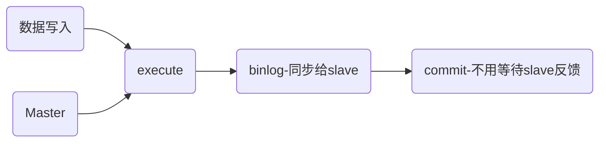
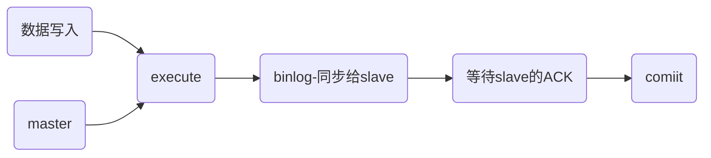
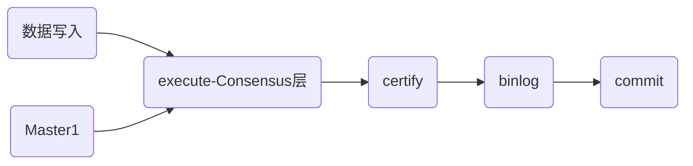

MGR部署

## MGR介绍

```sh
MySQL Group Replication（下简称：MGR）是MySQL官方推出的一种基于Paxos协议的状态机复制。在MGR出现之前，用户常见的
MySQL高可用方式，无论怎么变化架构，本质就是Master-Slave架构。MySQL 5.7版本开始支持无损半同步复制
（lossless semi-sync replication），从而进一步提示数据复制的强一致性
```

###  MySQL异步复制

```sh
master事务的提交不需要经过slave的确认，slave是否接收到master的binlog，master并不care。slave接收到的master 
binlog后先写relay log，最后异步地区执行relay log中的sql应用到自身。由于master的提交不需要确保slave relay log是
否被正确接受，当slave接受master binlog失败或者relay log应用失败，master无法感知
```




###  MySQL半同步复制

```sh
基于传统的异步存在的缺陷，mysql在5.5版本后推出半同步复制。可以说半同步复制是传统异步复制的改进，在master事务的commit
之前，必须确保一个slave收到relay log并且响应给master以后，才能进行事务的commit，但是slave对于relay log的应用仍然
是异步进行的
```




### MySQL组复制（MGR）

```sh
1.基于传统的异步复制和半同步复制的缺陷----数据的一致性问题无法保证，MySQL官方在5.7.17版本正式推出组复制(MySQL Group Replication)
2.由若干个节点共同组成一个复制组，一个事务的提交，必须经过组内大多数节点(N/2 + 1)决议并用过，才能得以生效。例如由
  3个节点组成一个复制组，Consensus层为一致性协议层，在事务提交过程中，发生组内通讯，由2个节点决议(certify)通过这个
  事务，事务才能最终得以提交并响应
3.引入组复制，主要是为了解决传统异步复制和半同步复制可能产生数据不一致的问题。组复制依靠分布式一致性协议(Paxos协议的变体)，
  实现分布式下数据的最终一致性，提供了真正的数据高可用方案(是否真正高可用还有待商榷)
```




### MySQL组复制的特性和限制

```sh
#特性优点
1.高一致性，基于原生复制及Paxos协议的组复制技术，并以插件形式提供，提供一致数据安全保证
2.高容错性，只要不是大多数节点坏掉就可以继续工作，有自动检测机制，当不同节点产生资源争用冲突时，不会出现错误，按照
  先到者优先原则进行处理，并且内置了自动化脑裂防护机制
3.高扩展性，有单主模式和多主模式，单主模式下，所有更新操作都在主上进行，多主模式下，所有server都可以同时处理更新操作
#限制（具体可以参考官方说明文档：https://dev.mysql.com/doc/refman/5.7/en/group-replication-requirements-and-limitations.html）
1.仅支持InnoDB表，并且每张表一定要有一个主键，用于做write set的冲突检测
2.必须打开GTID特性，二进制日志格式必须设置为ROW，用于选主与write set
3.COMMIT肯能会导致失败，类似于快照事务隔离级别的失败场景
4.日前一个MGR集群最多支持9个节点
5.不支持外键save point特性，无法做全局间的约束检测与部分事务回滚
6.二进制日志不支持binlog event checksum
```

## 单主模式

### 官方文档

```sh
1.官方文档：https://dev.mysql.com/doc/refman/5.7/en/group-replication.html
2.单主节点搭建地址：https://dev.mysql.com/doc/refman/5.7/en/group-replication-deploying-in-single-primary-mode.html
3.多主节点搭建基本和单主步骤一样，只需要配置文件my.cnf额外添加
  loose-group_replication_single_primary_mode=FALSE
  loose-group_replication_enforce_update_everywhere_checks= TRUE
```

### 考虑因素

```sh
1.可以使用group_replication_set_as_primary()指定特定成员作为新的主数据库(MySQL8.0.13或更高版本)
2.如果自动选举：
	2.1第一个因素：那些成员运行最低的MySQL Server版本
	2.2第二个因素：每个成员的成员权重，具体由group_replication_member_weight系统变量指定
	2.3第三个因素：每个成员所生成的服务器UUID的字典顺序，由server_uuid系统变量指定，服务器UUID最低的成员被选为主
	   服务器
```

### 实验环境

| ROLES  |      IP       | HOSTNAME | SERVER_ID | MySQL_VERSION | OPERATIO_SYSTEM |
| :----: | :-----------: | :------: | :-------: | :-----------: | :-------------: |
| master | 192.168.220.6 |   vm6    |    20     | MySQL 8.0.19  |    Centos7.7    |
| slave  | 192.168.220.7 |   vm7    |    21     | MySQL 8.0.19  |    Centos7.7    |
| slave  | 192.168.220.8 |   vm8    |    22     | MySQL 8.0.19  |    Centos7.7    |

### 实验需求

```sh
1.配置MGR单主模式
2.master主机为主服务器，提供写操作
3.另外2台为从服务器，提供读操作
```

### 基础环境

#### 三台免密

```sh
#三台配置相互的免密
```

#### 防火墙

```sh
1.可以关闭防火墙
2.放行服务和端口（三台都要放行）
  firewall-cmd   --add-service=mysql
  firewall-cmd   --add-service=mysql  --permanent 
  firewall-cmd  --add-port=3306/tcp 
  firewall-cmd  --add-port=3306/tcp  --permanent
  firewall-cmd  --add-port=33060/tcp
  firewall-cmd  --add-port=33060/tcp  --permanent
  firewall-cmd  --add-port=33061/tcp
  firewall-cmd  --add-port=33061/tcp  --permanent
  
  firewall-cmd  --reload
  firewall-cmd --list-all
```

#### 关闭SElinux

```sh
#置于disabled状态
```

#### UUID须不一样

```sh
cat  /data/mysql/auto.cnf
#可以在后面进行配置
```

### 安装配置

#### 下载安装

```sh
#地址：https://dev.mysql.com/downloads/mysql/8.0.html
#先将系统的mariadb卸载
1.yum -y remove 'mariadb*'
2.rpm的tar包下载
  wget https://dev.mysql.com/get/Downloads/MySQL-8.0/mysql-8.0.19-1.el7.x86_64.rpm-bundle.tar
  tar -xf mysql-8.0.19-1.el7.x86_64.rpm-bundle.tar
  yum localinstall -y mysql-community-common-8.0.19-1.el7.x86_64.rpm
  yum localinstall -y mysql-community-libs-8.0.19-1.el7.x86_64.rpm
  yum localinstall -y mysql-community-client-8.0.19-1.el7.x86_64.rpm
  yum localinstall -y mysql-community-server-8.0.19-1.el7.x86_64.rpm
  yum localinstall -y mysql-community-libs-compat-8.0.19-1.el7.x86_64.rpm
3.yum方式安装(比较慢)
#地址：https://dev.mysql.com/downloads/repo/yum/
  wget https://dev.mysql.com/get/mysql80-community-release-el7-3.noarch.rpm
  rpm -ivh mysql80-community-release-el7-3.noarch.rpm
  yum -y install mysql-community-common mysql-community-libs mysql-community-client  mysql-community-server mysql-community-libs-compat
4.确认安装的mysql包
  [root@vm6 ~]# rpm -qa | grep mysql
  mysql-community-server-8.0.19-1.el7.x86_64
  mysql-community-common-8.0.19-1.el7.x86_64
  mysql-community-client-8.0.19-1.el7.x86_64
  mysql-community-libs-compat-8.0.19-1.el7.x86_64
  mysql-community-libs-8.0.19-1.el7.x86_64
```

### 修改密码

```sh
systemctl restart mysqld
grep password /var/log/mysqld.log
mysqladmin -p'xxxx'  password '123qqq...A'
```

### 修改配置

```sh
#参照
https://dev.mysql.com/doc/refman/8.0/en/group-replication-configuring-instances.html
#连接认证参照
https://dev.mysql.com/doc/refman/8.0/en/upgrading-from-previous-series.html#upgrade-caching-sha2-password
```

#### 第一个节点配置

##### 配置文件

```sh
[root@vm6 ~]# mysql -p123qqq...A -e 'select uuid()'
mysql: [Warning] Using a password on the command line interface can be insecure.
+--------------------------------------+
| uuid()                               |
+--------------------------------------+
| 27513184-8787-11ea-8a41-000c297335a1 |
+--------------------------------------+

[root@vm6 ~]# cat /var/lib/mysql/auto.cnf 
[auto]
server-uuid=8a7a5e28-8783-11ea-af53-000c297335a1

[root@vm6 ~]# systemctl restart mysqld

[root@vm6 ~]# cat /var/lib/mysql/auto.cnf 
[auto]
server-uuid=8a7a5e28-8783-11ea-af53-000c297335a1
```

```sh
# For advice on how to change settings please see
# http://dev.mysql.com/doc/refman/8.0/en/server-configuration-defaults.html

[mysqld]
#
# Remove leading # and set to the amount of RAM for the most important data
# cache in MySQL. Start at 70% of total RAM for dedicated server, else 10%.
# innodb_buffer_pool_size = 128M
#
# Remove the leading "# " to disable binary logging
# Binary logging captures changes between backups and is enabled by
# default. It's default setting is log_bin=binlog
# disable_log_bin
#
# Remove leading # to set options mainly useful for reporting servers.
# The server defaults are faster for transactions and fast SELECTs.
# Adjust sizes as needed, experiment to find the optimal values.
# join_buffer_size = 128M
# sort_buffer_size = 2M
# read_rnd_buffer_size = 2M
#
# Remove leading # to revert to previous value for default_authentication_plugin,
# this will increase compatibility with older clients. For background, see:
# https://dev.mysql.com/doc/refman/8.0/en/server-system-variables.html#sysvar_default_authentication_plugin
# default-authentication-plugin=mysql_native_password
datadir=/var/lib/mysql
socket=/var/lib/mysql/mysql.sock

log-error=/var/log/mysqld.log
pid-file=/var/run/mysqld/mysqld.pid
#Storage Engines
disabled_storage_engines="MyISAM,BLACKHOLE,FEDERATED,ARCHIVE,MEMORY"
#Replication Framework
server_id=20
log_bin=logbin
binlog_format=ROW
log_bin_index=/var/lib/mysql/master.index
#MySQL要求所有caching_sha2_password（复制用户上的身份验证类型）均受TLS或RSA保护
#caching_sha2_password是MySQL8.0首选默认身份验证插件，而不是mysql_native_password
#如果8.0想用mysql_native_password,需要设置default_authentication_plugin=mysql_native_password
group_replication_recovery_get_public_key = 1 
#允许下端接入slave
log_slave_updates=ON  
#可以利用select * from mysql.slave_master_info;和select * from mysql.slave_relay_log_info;查询主从同步情况
master_info_repository=TABLE 
relay_log_info_repository=TABLE
gtid_mode=ON
enforce_gtid_consistency=ON
binlog_checksum=NONE
#Group Replication Settings
plugin_load_add='group_replication.so'
transaction_write_set_extraction=XXHASH64
#这里只要是uuid的格式即可
group_replication_group_name="27513184-8787-11ea-8a41-000c297335a1"
#是否随服务器启动而启动组复制
group_replication_start_on_boot=off 
group_replication_local_address= "192.168.220.6:33061"
group_replication_group_seeds= "192.168.220.6:33061,192.168.220.7:33061,192.168.220.8:33061"
#引导组成员的组，这个用于第一次搭建MGR跟重新搭建MGR的时候使用
group_replication_bootstrap_group=off 
#是否启动单主模式，如果启动，则本实例是主库，提供读写，其他实例仅提供读
group_replication_single_primary_mode=ON

#重启
systemctl restart mysqld
```

##### 创建用于分布式恢复的复制用户

```sh

[root@vm6 ~]#mysql -p123qqq...A
mysql> set sql_log_bin=0;
Query OK, 0 rows affected (0.00 sec)

mysql> create user repl@'%' identified  by '123qqq...A'; #本地密码设置  with mysql_native_password
Query OK, 0 rows affected (0.02 sec)
#授权用于复制
mysql> grant replication slave on *.* to repl@'%';
Query OK, 0 rows affected (0.00 sec)
#授权用于在捐赠者上的克隆操作
mysql> grant backup_admin on *.* to repl@'%';
Query OK, 0 rows affected (0.00 sec)

mysql> flush privileges;
Query OK, 0 rows affected (0.00 sec)

mysql> set sql_log_bin=1;
Query OK, 0 rows affected (0.01 sec)
#创建用户后，使用CHANGE MASTER TO语句将服务器配置为通过分布式恢复或远程克隆操作，使用给定凭据进行状态传输。
mysql> change master to master_user='repl', master_password='123qqq...A' for channel 'group_replication_recovery';
Query OK, 0 rows affected, 2 warnings (0.03 sec)
```

##### 启动组复制

```sh
mysql> SHOW PLUGINS;
+---------------------------------+----------+--------------------+----------------------+---------+
| Name                            | Status   | Type               | Library              | License |
+---------------------------------+----------+--------------------+----------------------+---------+
| group_replication               | ACTIVE   | GROUP REPLICATION  | group_replication.so | GPL     |
+---------------------------------+----------+--------------------+----------------------+---------+
45 rows in set (0.01 sec)

mysql> select User,Host from mysql.user;
+------------------+-----------+
| User             | Host      |
+------------------+-----------+
| repl             | %         |
| mysql.infoschema | localhost |
| mysql.session    | localhost |
| mysql.sys        | localhost |
| root             | localhost |
+------------------+-----------+
5 rows in set (0.00 sec)
```

##### 自举启动组

```sh
#启动引导组
mysql> set global group_replication_bootstrap_group=on;
Query OK, 0 rows affected (0.00 sec)
#开启组复制
mysql> start group_replication;
Query OK, 0 rows affected (3.20 sec)
#关闭引导组，防止脑裂
mysql> set global group_replication_bootstrap_group=Off;
Query OK, 0 rows affected (0.00 sec)
#检查组信息及组成员
mysql> SELECT * FROM performance_schema.replication_group_members;
+---------------------------+--------------------------------------+-------------+-------------+--------------+-------------+----------------+
| CHANNEL_NAME              | MEMBER_ID                            | MEMBER_HOST | MEMBER_PORT | MEMBER_STATE | MEMBER_ROLE | MEMBER_VERSION |
+---------------------------+--------------------------------------+-------------+-------------+--------------+-------------+----------------+
| group_replication_applier | 8a7a5e28-8783-11ea-af53-000c297335a1 | vm6         |        3306 | ONLINE       | PRIMARY     | 8.0.19         |
+---------------------------+--------------------------------------+-------------+-------------+--------------+-------------+----------------+
1 row in set (0.01 sec)
```

#### 第二个节点配置

##### 配置文件

```sh
# For advice on how to change settings please see
# http://dev.mysql.com/doc/refman/8.0/en/server-configuration-defaults.html

[mysqld]
#
# Remove leading # and set to the amount of RAM for the most important data
# cache in MySQL. Start at 70% of total RAM for dedicated server, else 10%.
# innodb_buffer_pool_size = 128M
#
# Remove the leading "# " to disable binary logging
# Binary logging captures changes between backups and is enabled by
# default. It's default setting is log_bin=binlog
# disable_log_bin
#
# Remove leading # to set options mainly useful for reporting servers.
# The server defaults are faster for transactions and fast SELECTs.
# Adjust sizes as needed, experiment to find the optimal values.
# join_buffer_size = 128M
# sort_buffer_size = 2M
# read_rnd_buffer_size = 2M
#
# Remove leading # to revert to previous value for default_authentication_plugin,
# this will increase compatibility with older clients. For background, see:
# https://dev.mysql.com/doc/refman/8.0/en/server-system-variables.html#sysvar_default_authentication_plugin
# default-authentication-plugin=mysql_native_password
datadir=/var/lib/mysql
socket=/var/lib/mysql/mysql.sock

log-error=/var/log/mysqld.log
pid-file=/var/run/mysqld/mysqld.pid
#Storage Engines
disabled_storage_engines="MyISAM,BLACKHOLE,FEDERATED,ARCHIVE,MEMORY"
#Replication Framework
server_id=21
log_bin=logbin
binlog_format=ROW
log_bin_index=/var/lib/mysql/slave1.index
#MySQL要求所有caching_sha2_password（复制用户上的身份验证类型）均受TLS或RSA保护
group_replication_recovery_get_public_key = 1 
#允许下端接入slave
log_slave_updates=ON  
#可以利用select * from mysql.slave_master_info;和select * from mysql.slave_relay_log_info;查询主从同步情况
master_info_repository=TABLE 
relay_log_info_repository=TABLE
gtid_mode=ON
enforce_gtid_consistency=ON
binlog_checksum=NONE
#Group Replication Settings
plugin_load_add='group_replication.so'
transaction_write_set_extraction=XXHASH64
group_replication_group_name="27513184-8787-11ea-8a41-000c297335a1"
#是否随服务器启动而启动组复制
group_replication_start_on_boot=off 
group_replication_local_address= "192.168.220.7:33061"
group_replication_group_seeds= "192.168.220.6:33061,192.168.220.7:33061,192.168.220.8:33061"
#引导组成员的组，这个用于第一次搭建MGR跟重新搭建MGR的时候使用
group_replication_bootstrap_group=off 
#是否启动单主模式，如果启动，则本实例是主库，提供读写，其他实例仅提供读
group_replication_single_primary_mode=ON

#重启
systemctl restart mysqld
```

##### 创建用于分布式恢复的复制用户

```sh
[root@vm7 ~]#mysql -p123qqq...A
mysql> set sql_log_bin=0;
Query OK, 0 rows affected (0.00 sec)

mysql> create user repl@'%' identified by '123qqq...A';
Query OK, 0 rows affected (0.02 sec)
#授权用于复制
mysql> grant replication slave on *.* to repl@'%';
Query OK, 0 rows affected (0.00 sec)
#授权用于在捐赠者上的克隆操作
mysql> grant backup_admin on *.* to 'repl'@'%';
Query OK, 0 rows affected (0.00 sec)

mysql> flush privileges;
Query OK, 0 rows affected (0.00 sec)

mysql> set sql_log_bin=1;
Query OK, 0 rows affected (0.01 sec)
#创建用户后，使用CHANGE MASTER TO语句将服务器配置为通过分布式恢复或远程克隆操作，使用给定凭据进行状态传输。
mysql> change master to master_user='repl', master_password='123qqq...A' for channel 'group_replication_recovery';
Query OK, 0 rows affected, 2 warnings (0.03 sec)
```

##### 启动组复制

```sh
#启动
mysql> start group_replication;
Query OK, 0 rows affected (3.92 sec)
#查询组信息及成员
mysql> SELECT * FROM performance_schema.replication_group_members;
+---------------------------+--------------------------------------+-------------+-------------+--------------+-------------+----------------+
| CHANNEL_NAME              | MEMBER_ID                            | MEMBER_HOST | MEMBER_PORT | MEMBER_STATE | MEMBER_ROLE | MEMBER_VERSION |
+---------------------------+--------------------------------------+-------------+-------------+--------------+-------------+----------------+
| group_replication_applier | 05eb9528-8783-11ea-a390-000c29979dd7 | vm7         |        3306 | ONLINE       | SECONDARY   | 8.0.19         |
| group_replication_applier | 8a7a5e28-8783-11ea-af53-000c297335a1 | vm6         |        3306 | ONLINE       | PRIMARY     | 8.0.19         |
+---------------------------+--------------------------------------+-------------+-------------+--------------+-------------+----------------+
2 rows in set (0.01 sec)
```

#### 第三个节点配置

##### 配置文件

```sh
# For advice on how to change settings please see
# http://dev.mysql.com/doc/refman/8.0/en/server-configuration-defaults.html

[mysqld]
#
# Remove leading # and set to the amount of RAM for the most important data
# cache in MySQL. Start at 70% of total RAM for dedicated server, else 10%.
# innodb_buffer_pool_size = 128M
#
# Remove the leading "# " to disable binary logging
# Binary logging captures changes between backups and is enabled by
# default. It's default setting is log_bin=binlog
# disable_log_bin
#
# Remove leading # to set options mainly useful for reporting servers.
# The server defaults are faster for transactions and fast SELECTs.
# Adjust sizes as needed, experiment to find the optimal values.
# join_buffer_size = 128M
# sort_buffer_size = 2M
# read_rnd_buffer_size = 2M
#
# Remove leading # to revert to previous value for default_authentication_plugin,
# this will increase compatibility with older clients. For background, see:
# https://dev.mysql.com/doc/refman/8.0/en/server-system-variables.html#sysvar_default_authentication_plugin
# default-authentication-plugin=mysql_native_password

datadir=/var/lib/mysql
socket=/var/lib/mysql/mysql.sock

log-error=/var/log/mysqld.log
pid-file=/var/run/mysqld/mysqld.pid

#Storage Engines
disabled_storage_engines="MyISAM,BLACKHOLE,FEDERATED,ARCHIVE,MEMORY"
#Replication Framework
server_id=22
log_bin=logbin
binlog_format=ROW
log_bin_index=/var/lib/mysql/slave2.index
#MySQL要求所有caching_sha2_password（复制用户上的身份验证类型）均受TLS或RSA保护
group_replication_recovery_get_public_key = 1 
#允许下端接入slave
log_slave_updates=ON  
#可以利用select * from mysql.slave_master_info;和select * from mysql.slave_relay_log_info;查询主从同步情况
master_info_repository=TABLE 
relay_log_info_repository=TABLE
gtid_mode=ON
enforce_gtid_consistency=ON
binlog_checksum=NONE
#Group Replication Settings
plugin_load_add='group_replication.so'
transaction_write_set_extraction=XXHASH64
group_replication_group_name="27513184-8787-11ea-8a41-000c297335a1"
#是否随服务器启动而启动组复制
group_replication_start_on_boot=off 
group_replication_local_address= "192.168.220.8:33061"
group_replication_group_seeds= "192.168.220.6:33061,192.168.220.7:33061,192.168.220.8:33061"
#引导组成员的组，这个用于第一次搭建MGR跟重新搭建MGR的时候使用
group_replication_bootstrap_group=off 
#是否启动单主模式，如果启动，则本实例是主库，提供读写，其他实例仅提供读
group_replication_single_primary_mode=ON

#重启服务
systemctl restart mysqld
```

##### 创建用于分布式恢复的复制用户

```sh
[root@vm7 ~]#mysql -p123qqq...A
mysql> set sql_log_bin=0;
Query OK, 0 rows affected (0.00 sec)

mysql> create user repl@'%' identified by '123qqq...A';
Query OK, 0 rows affected (0.02 sec)
#授权用于复制
mysql> grant replication slave on *.* to repl@'%';
Query OK, 0 rows affected (0.00 sec)
#授权用于在捐赠者上的克隆操作
mysql> grant backup_admin on *.* to repl@'%';
Query OK, 0 rows affected (0.00 sec)

mysql> flush privileges;
Query OK, 0 rows affected (0.00 sec)

mysql> set sql_log_bin=1;
Query OK, 0 rows affected (0.01 sec)
#创建用户后，使用CHANGE MASTER TO语句将服务器配置为通过分布式恢复或远程克隆操作，使用给定凭据进行状态传输。
mysql> change master to master_user='repl', master_password='123qqq...A' for channel 'group_replication_recovery';
Query OK, 0 rows affected, 2 warnings (0.03 sec)
```

##### 启动组复制

```sh
#启动
mysql> start group_replication;
Query OK, 0 rows affected (3.92 sec)
#查询组信息及成员
mysql> SELECT * FROM performance_schema.replication_group_members;
+---------------------------+--------------------------------------+---------------+-------------+--------------+-------------+----------------+
| CHANNEL_NAME              | MEMBER_ID                            | MEMBER_HOST   | MEMBER_PORT | MEMBER_STATE | MEMBER_ROLE | MEMBER_VERSION |
+---------------------------+--------------------------------------+---------------+-------------+--------------+-------------+----------------+
| group_replication_applier | 8a7a5e28-8783-11ea-af53-000c297335a1 | vm6           |        3306 | ONLINE       | PRIMARY     | 8.0.19         |
| group_replication_applier | ae9e166a-8794-11ea-bf79-000c29979dd7 | vm7           |        3306 | ONLINE       | SECONDARY   | 8.0.19         |
| group_replication_applier | ae9e765e-8794-11ea-bf18-000c29980101 | vm8           |        3306 | ONLINE       | SECONDARY   | 8.0.19         |
+---------------------------+--------------------------------------+---------------+-------------+--------------+-------------+----------------+
```

## 多主

### 添加配置

```sh
按照以上实验环境，配置MGR多主模式
group_replication_recovery: 此通道用于与分布式恢复阶段相关的复制更改
group_replication_applier :此通道用于来自组的传入更改。这是用于应用直接来自组的事务的通道

#在三个节点分别添加以下配置并重启
group_replication_single_primary_mode=OFF 
group_replication_enforce_update_everywhere_checks=ON
```

### 启动复制组

```sh
#启动192.168.220.6主机上的复制模式
#启动引导组
mysql> set global group_replication_bootstrap_group=on;
Query OK, 0 rows affected (0.00 sec)
#开启组复制
mysql> start group_replication;
Query OK, 0 rows affected (3.17 sec)
#关闭引导组，防止脑裂
mysql> set global group_replication_bootstrap_group=Off;
Query OK, 0 rows affected (0.00 sec)
#查询组成员
mysql> SELECT * FROM performance_schema.replication_group_members; 
+---------------------------+--------------------------------------+---------------+-------------+--------------+-------------+----------------+
| CHANNEL_NAME              | MEMBER_ID                            | MEMBER_HOST   | MEMBER_PORT | MEMBER_STATE | MEMBER_ROLE | MEMBER_VERSION |
+---------------------------+--------------------------------------+---------------+-------------+--------------+-------------+----------------+
| group_replication_applier | 8a7a5e28-8783-11ea-af53-000c297335a1 | 192.168.220.6 |        3306 | ONLINE       | PRIMARY     | 8.0.19         |
+---------------------------+--------------------------------------+---------------+-------------+--------------+-------------+----------------+
1 row in set (0.01 sec)
```

### 启动其它节点

```sh
#启动192.168.220.7、192.168.220.8
start group_replication;
#查看状态
mysql> SELECT * FROM performance_schema.replication_group_members;
+---------------------------+--------------------------------------+---------------+-------------+--------------+-------------+----------------+
| CHANNEL_NAME              | MEMBER_ID                            | MEMBER_HOST   | MEMBER_PORT | MEMBER_STATE | MEMBER_ROLE | MEMBER_VERSION |
+---------------------------+--------------------------------------+---------------+-------------+--------------+-------------+----------------+
| group_replication_applier | 8a7a5e28-8783-11ea-af53-000c297335a1 | vm6           |        3306 | ONLINE       | PRIMARY     | 8.0.19         |
| group_replication_applier | ae9e166a-8794-11ea-bf79-000c29979dd7 | vm7           |        3306 | ONLINE       | PRIMARY     | 8.0.19         |
| group_replication_applier | ae9e765e-8794-11ea-bf18-000c29980101 | vm8           |        3306 | ONLINE       | PRIMARY     | 8.0.19         |
+---------------------------+--------------------------------------+---------------+-------------+--------------+-------------+----------------+
3 rows in set (0.00 sec)
```

## 生产环境相关详细配置

### HOST01

```sh
[mysql]
default-character-set = utf8mb4
socket = /usr/local/mysql/mysql.sock

[mysqld]
#skip-grant-tables
user = root
port = 3306
server_id = 20
basedir = /usr/local/mysql
datadir = /usr/local/mysql/data
socket = /usr/local/mysql/mysql.sock

log_bin = /usr/local/mysql/log/mysql-bin
relay_log = /usr/local/mysql/log/relay.log
relay-log-index = /usr/local/mysql/log/relay.index

innodb_log_group_home_dir = /usr/local/mysql/log
tmpdir = /tmp
report_host = 192.168.18.50 #当节点hostname无法通过DNS正常解析，需要通过report_host

character_set_server = utf8mb4
log_bin_trust_function_creators = ON

sql_mode = "STRICT_TRANS_TABLES,NO_ZERO_IN_DATE,NO_ZERO_DATE,ERROR_FOR_DIVISION_BY_ZERO,NO_ENGINE_SUBSTITUTION"

#BINLOG
binlog_error_action = ABORT_SERVER
binlog_format = ROW
binlog_checksum = NONE
binlog_rows_query_log_events = 1
log_slave_updates = 1
master_info_repository = TABLE
max_binlog_size = 250M
relay_log_info_repository = TABLE
relay_log_recovery = 1
sync_binlog = 1

#GTID
gtid_mode = ON
enforce_gtid_consistency = ON

#ENGINE
default_storage_engine = InnoDB
innodb_buffer_pool_size = 128M
innodb_data_file_path = ibdata1:1G:autoextend
innodb_file_per_table = 1
innodb_io_capacity = 200
innodb_log_buffer_size = 64M
innodb_log_file_size = 256M
innodb_log_files_in_group = 2
innodb_max_dirty_pages_pct = 60
innodb_print_all_deadlocks = 1
innodb_stats_on_metadata = 0
innodb_strict_mode = 1
innodb_thread_concurrency = 24

#CACHE
tmp_table_size = 32M
table_open_cache = 1024
max_connections = 3000
thread_cache_size = 1024
open_files_limit = 65535

#SLOWLOG
slow_query_log = 1
slow_query_log_file = /usr/local/mysql/log/mysql-slow.log
log_slow_admin_statements = 1
log_slow_slave_statements = 1
long_query_time = 1

#MGR
plugin_load_add = "group_replication.so"
loose-transaction_write_set_extraction = XXHASH64
loose-group_replication_autorejoin_tries = 12
loose-group_replication_consistency = "AFTER"
loose-group_replication_group_name = "ab54464d-6d68-9487-cb66-363a73a81ca1"
loose-group_replication_start_on_boot = off
loose-group_replication_local_address = "192.168.18.50:33061"
loose-group_replication_group_seeds = "192.168.18.50:33061,192.168.18.51:33061,192.168.18.52:33061"
loose-group_replication_bootstrap_group = off
loose-group_replication_ip_whitelist = "192.168.18.50,192.168.18.51,192.168.18.52"
#loose-group_replication_member_weight = 50

#zhu
loose-binlog_transaction_dependency_tracking = "WRITESET_SESSION"

[mysqld_safe]
log-error = /usr/local/mysql/log/error.log
```

### HOST02

```sh
[mysql]
default-character-set = utf8mb4
socket = /usr/local/mysql/mysql.sock

[mysqld]
#skip-grant-tables
user = root
port = 3306
server_id = 1921681851
basedir = /usr/local/mysql
datadir = /usr/local/mysql/data
socket = /usr/local/mysql/mysql.sock

log_bin = /usr/local/mysql/log/mysql-bin
relay_log = /usr/local/mysql/log/relay.log
relay-log-index = /usr/local/mysql/log/relay.index

innodb_log_group_home_dir = /usr/local/mysql/log
tmpdir = /tmp
report_host = 192.168.18.51

character_set_server = utf8mb4
log_bin_trust_function_creators = ON

sql_mode = "STRICT_TRANS_TABLES,NO_ZERO_IN_DATE,NO_ZERO_DATE,ERROR_FOR_DIVISION_BY_ZERO,NO_ENGINE_SUBSTITUTION"

#BINLOG
binlog_error_action = ABORT_SERVER
binlog_format = ROW
binlog_checksum = NONE
binlog_rows_query_log_events = 1
log_slave_updates = 1
master_info_repository = TABLE
max_binlog_size = 250M
relay_log_info_repository = TABLE
relay_log_recovery = 1
sync_binlog = 1

#GTID
gtid_mode = ON
enforce_gtid_consistency = ON

#ENGINE
default_storage_engine = InnoDB
innodb_buffer_pool_size = 128M
innodb_data_file_path = ibdata1:1G:autoextend
innodb_file_per_table = 1
innodb_io_capacity = 200
innodb_log_buffer_size = 64M
innodb_log_file_size = 256M
innodb_log_files_in_group = 2
innodb_max_dirty_pages_pct = 60
innodb_print_all_deadlocks = 1
innodb_stats_on_metadata = 0
innodb_strict_mode = 1
innodb_thread_concurrency = 24

#CACHE
tmp_table_size = 32M
table_open_cache = 1024
max_connections = 3000
thread_cache_size = 1024
open_files_limit = 65535

#SLOWLOG
slow_query_log = 1
slow_query_log_file = /usr/local/mysql/log/mysql-slow.log
log_slow_admin_statements = 1
log_slow_slave_statements = 1group_replication_autorejoin_tries
long_query_time = 1

#MGR
plugin_load_add = "group_replication.so"
loose-transaction_write_set_extraction = XXHASH64
loose-group_replication_autorejoin_tries = 12
loose-group_replication_consistency = "AFTER"
loose-group_replication_group_name = "ab54464d-6d68-9487-cb66-363a73a81ca1"
loose-group_replication_start_on_boot = off
loose-group_replication_local_address = "192.168.18.51:33061"
loose-group_replication_group_seeds = "192.168.18.50:33061,192.168.18.51:33061,192.168.18.52:33061"
loose-group_replication_bootstrap_group = off
loose-group_replication_ip_whitelist = "192.168.18.50,192.168.18.51,192.168.18.52"
#loose-group_replication_member_weight = 50

#cong MTS
slave_parallel_type = "LOGICAL_CLOCK"
slave_parallel_workers = 16
slave_preserve_commit_order = 1

[mysqld_safe]
log-error = /usr/local/mysql/log/error.log
```

### HOST03

```sh
[mysql]
default-character-set = utf8mb4
socket = /usr/local/mysql/mysql.sock

[mysqld]
#skip-grant-tables
user = root
port = 3306
server_id = 1921681852
basedir = /usr/local/mysql
datadir = /usr/local/mysql/data
socket = /usr/local/mysql/mysql.sock

log_bin = /usr/local/mysql/log/mysql-bin
relay_log = /usr/local/mysql/log/relay.log
relay-log-index = /usr/local/mysql/log/relay.index

innodb_log_group_home_dir = /usr/local/mysql/log
tmpdir = /tmp
report_host = 192.168.18.52

character_set_server = utf8mb4
log_bin_trust_function_creators = ON

sql_mode = "STRICT_TRANS_TABLES,NO_ZERO_IN_DATE,NO_ZERO_DATE,ERROR_FOR_DIVISION_BY_ZERO,NO_ENGINE_SUBSTITUTION"

#BINLOG
binlog_error_action = ABORT_SERVER
binlog_format = ROW
binlog_checksum = NONE
binlog_rows_query_log_events = 1
log_slave_updates = 1
master_info_repository = TABLE
max_binlog_size = 250M
relay_log_info_repository = TABLE
relay_log_recovery = 1
sync_binlog = 1

#GTID
gtid_mode = ON
enforce_gtid_consistency = ON

#ENGINE
default_storage_engine = InnoDB
innodb_buffer_pool_size = 128M
innodb_data_file_path = ibdata1:1G:autoextend
innodb_file_per_table = 1
innodb_io_capacity = 200
innodb_log_buffer_size = 64M
innodb_log_file_size = 256M
innodb_log_files_in_group = 2
innodb_max_dirty_pages_pct = 60
innodb_print_all_deadlocks = 1
innodb_stats_on_metadata = 0
innodb_strict_mode = 1
innodb_thread_concurrency = 24

#CACHE
tmp_table_size = 32M
table_open_cache = 1024
max_connections = 3000
thread_cache_size = 1024
open_files_limit = 65535

#SLOWLOG
slow_query_log = 1
slow_query_log_file = /usr/local/mysql/log/mysql-slow.log
log_slow_admin_statements = 1
log_slow_slave_statements = 1
long_query_time = 1

#MGR
plugin_load_add = "group_replication.so"
loose-transaction_write_set_extraction = XXHASH64
loose-group_replication_autorejoin_tries = 12
loose-group_replication_consistency = "AFTER"
loose-group_replication_group_name = "ab54464d-6d68-9487-cb66-363a73a81ca1"
loose-group_replication_start_on_boot = off
loose-group_replication_local_address = "192.168.18.52:33061"
loose-group_replication_group_seeds = "192.168.18.50:33061,192.168.18.51:33061,192.168.18.52:33061"
loose-group_replication_bootstrap_group = off
loose-group_replication_ip_whitelist = "192.168.18.50,192.168.18.51,192.168.18.52"
#loose-group_replication_member_weight = 50

#cong MTS
slave_parallel_type = "LOGICAL_CLOCK"
slave_parallel_workers = 16
slave_preserve_commit_order = 1

[mysqld_safe]
log-error = /usr/local/mysql/log/error.log
```

## 管理维护

```sh
#查看GROUP中的成员有哪些
SELECT * FROM performance_schema.replication_group_members;
#单主模式下主库是哪个
SELECT * FROM performance_schema.replication_group_members;
SELECT * FROM performance_schema. global_status where variable_name='group_replication_primary_member';
show global variables like 'server_uuid';
#检查数据库是否正常提供读写服务 
mysql> show global variables like 'super%';
+-----------------+-------+
| Variable_name   | Value |
+-----------------+-------+
| super_read_only | OFF   |
+-----------------+-------+
1 row in set (0.03 sec)
#检查数据库是否复制出现问题
通过表格replication_group_members ，replication_group_member_stats 
       replication_connection_stats, replication_applier_stats 查看
重点注意各个组成员的 ERROR LOG详细信息
```

## 故障模拟及处理

### 单主模式

#### 宕机情况

```sh
1.#master被kill掉
  判断剩余个数是否超过所有节点输的一半，也就是宕机实例小于（n-1）/2,若满足，则会启动新的GROUP，按照GROUP中各个实例
  的UUID进行升序排序，选择第一个slave作为新的主库，由于新主库之前是super_read_only状态，仅支持只读，升级为新主库
  后，会执行不设置super_read_only，关闭此参数，那么新主库则是可提供读写服务，原先的slave依旧是slave，super_read
  _only依旧为启动状态，仅提供读服务
2.#从库宕机一台
  剩余的master和slave正常服务
3.#从库宕机两台
  slave的MEMEBER_STATE状态显示为UNREACHABLE，master依然是ONLINE，但是只能提供读服务，不能提供写服务
  此时可以添加新的slave或者或者stop group_replication，使得master可以正常读写
```

#### 新增实例

```sh
1.#新增从库：mysqldump新增
1.1#备份数据
mysqldump -root -pxxx --set-gtid-purged=OFF  --triggers --routines --events --all-databases > all_databases.sql
1.2#新建实例
先安装group_replication引擎，然后再source数据，避免source数据后由于环境问题导致group_replication引擎安装问题
INSTALL PLUGIN group_replication SONAME 'group_replication.so';
1.3#导入数据
source  all_databases.sql
1.4#检查当前的binlog跟gtid使用情况
show master status; #此时的Executed_Gtid_Set应该为空,如果不为空，执行reset master后执行gtid_purge语句  
例如：SET @@GLOBAL.GTID_PURGED='27513184-8787-11ea-8a41-000c297335a1:1-3';
1.5开启组复制
CHANGE MASTER TO MASTER_USER='repl', MASTER_PASSWORD='123qqq...A' FOR CHANNEL 'group_replication_recovery';
START GROUP_REPLICATION;
```

### 多主模式

#### 单主切换到多主

```sh
1) 停止组复制(在所有MGR节点上执行)：
stop group_replication;
set global group_replication_single_primary_mode=OFF;
set global group_replication_enforce_update_everywhere_checks=ON;
 2) 随便选择某个MGR节点执行 (比如这里选择在MGR-node1节点):
SET GLOBAL group_replication_bootstrap_group=ON;
START GROUP_REPLICATION;
SET GLOBAL group_replication_bootstrap_group=OFF;
3) 然后在其他的MGR节点执行 (这里指MGR-node2和MGR-node3节点上执行):
START GROUP_REPLICATION;
4) 查看MGR组信息 (在任意一个MGR节点上都可以查看)
SELECT * FROM performance_schema.replication_group_members;
```

#### 单主切换到多主

```bash
1) 停止组复制(在所有MGR节点上执行)：
stop group_replication;
set global group_replication_enforce_update_everywhere_checks=OFF;
set global group_replication_single_primary_mode=ON;
2) 选择一个节点作为主节点, 在主节点上执行 (这里选择MGR-node1节点作为主节点)
SET GLOBAL group_replication_bootstrap_group=ON;
START GROUP_REPLICATION;
SET GLOBAL group_replication_bootstrap_group=OFF;
3) 在其他剩余的节点, 也就是从库节点上执行 (这里从库节点指的就是MGR-node2和MGR-node3):
START GROUP_REPLICATION;
4) 查看MGR组信息 (在任意一个MGR节点上都可以查看)
SELECT * FROM performance_schema.replication_group_members;
```

#### 宕机一台

```sh
#剔除节点，正常工作
```

#### 重新加入

```sh
STOP GROUP_REPLICATION;
set global group_replication_single_primary_mode=ON;
CHANGE MASTER TO MASTER_USER='repl', MASTER_PASSWORD='123qqq...A' FOR CHANNEL 'group_replication_recovery';
START GROUP_REPLICATION;
```

#### 一次性宕机超过合理数

```sh
1.5台server端，一口气停机了3台，则3台的status修改为UNREACHABLE，剩下的2台为ONLINE，虽然super_read_only是关闭的
  状态，但是这两台server不提供写功能，仅提供读功能
2.如果这个时候，发生DML操作，则会挂起该操作，一直处于等待状态，其他链接可以正常连接数据库进行操作
3.但是如果发生DDL操作，这个时候，不仅该会话处于等待状态，而且其他新的连接将无法执行use dbname(涉及操作的DBname）
  进入到该数据库中进行任何查询操作，但是可以在其他数据库上使用dbname.tbname 方式查询
  例如select * from dbgroup.alld！
```

#### 三个节点故障需要重置复制组

```
第一个节点
mysql> reset master;
mysql> SET SQL_LOG_BIN=1;
mysql> CHANGE MASTER TO MASTER_USER='rpl_slave', MASTER_PASSWORD='slave@123' FOR CHANNEL 'group_replication_recovery';
mysql> STOP GROUP_REPLICATION;
mysql> SET GLOBAL group_replication_bootstrap_group=ON;
mysql> START GROUP_REPLICATION;
mysql> SET GLOBAL group_replication_bootstrap_group=OFF;
mysql> SELECT * FROM performance_schema.replication_group_members;
  
第二个节点
mysql> reset master;
mysql> SET SQL_LOG_BIN=1;
mysql> CHANGE MASTER TO MASTER_USER='rpl_slave', MASTER_PASSWORD='slave@123' FOR CHANNEL 'group_replication_recovery';
mysql> START GROUP_REPLICATION;
mysql> SELECT * FROM performance_schema.replication_group_members;
  
第三个节点
mysql> reset master;
mysql> SET SQL_LOG_BIN=1;
mysql> CHANGE MASTER TO MASTER_USER='rpl_slave', MASTER_PASSWORD='slave@123' FOR CHANNEL 'group_replication_recovery';
mysql> START GROUP_REPLICATION;
mysql> SELECT * FROM performance_schema.replication_group_members;
```

#### 设置白名单网段

```bash
'[GCS] The member is leaving a group without being on one.'
这是因为没有设置白名单网段:需要添加节点自己所在网段.
  
在任意一个MGR节点上执行:
# 添加白名单网段
stop group_replication;
set global group_replication_ip_whitelist="127.0.0.1/32,172.16.60.0/24,172.16.50.0/24,172.16.51.0/24";
start group_replication;
show variables like "group_replication_ip_whitelist";
group_replication_ip_whitelist = <ip,net,...> 
表示设置白名单，若不配置默认为AUTOMATIC，自动识别本机网口的私网地址和私网网段，127.0.0.1 连接请求始终被允许，
一定要注意: 配置白名单前面一定要先关闭 Group Replication, 及先要执行"stop group_replication;"

也可以在/etc/my.cnf文件里配置白名单信息
```

#### 生产建库

```bash
CREATE DATABASE IF NOT EXISTS platform_auth30002 DEFAULT CHARACTER SET utf8mb4 DEFAULT COLLATE utf8mb4_general_ci;
```

## 备份数据库

```sh
1.备份数据库或表
    连接localhost通常通过一个Unix域套接字文件进行，一般是/tmp/mysql.sock。如果套接字文件被删除了，本地客户就不能连接。这可能发生在你的系统运行一个cron任务删除了/tmp下的临时文件。

如果你因为丢失套接字文件而不能连接，你可以简单地通过重启服务器重新创建得到它。因为服务器在启动时重新创建它。
1.1#mysqldump不锁表备份
/bin/mysqldump -uroot -ptop123456 --socket=/usr/local/mysql/mysql.sock --set-gtid-purged=OFF --skip-opt --triggers --routines --events -A --single-transaction --master-data=2 |/bin/gzip > /tmp/jerry/backup_$(date +%F).gz
1.2#排除一部分数据库备份
mysqldump -uroot -p123456 --databases db1 db2 db3 > mysqldump.sql
或者
mysql -uroot -p123456 -e 'show databases;'|grep -E -v "Database|information_schema|mysql|performance_schema" |xargs mysqldump -uroot -p123456  --socket=/usr/local/mysql/mysql.sock --set-gtid-purged=OFF --skip-opt --triggers --routines --events --databases --single-transaction --master-data=2 |/bin/gzip > /tmp/jerry/backup_$(date +%F).gz
其中
--socket=/usr/local/mysql/mysql.sock  通过  netstat ln |  grep mysql 查看
1.3#压缩备份数据库
mysqldump  -uroot -proot123 --set-gtid-purged=OFF --skip-opt --triggers --routines              --events --databases mysql  | gzip > /data/mysqldump/mysql_$(date +%F).gz
1.4#仅压缩备份数据库结构
mysqldump  -uroot -proot123  --set-gtid-purged=OFF  --triggers --routines --events \
                         --no-data --databases  mysql | gzip > /data/mysqldump/mysql_$(date +%F).gz
1.5#不压缩备份数据库
mysqldump  -uroot -proot123 --set-gtid-purged=OFF  --triggers --routines --events \
                         --databases mysql  > mysql_bak.sql
#备份某个（些）表	#（备份mysql库吓得两个表）
mysqldump -uroot -proot123 --set-gtid-purged=OFF  --triggers --routines --events \
	                     --datebases mysql --tabels user db > user_db.sql
1.6#仅备份某个（些）表结构
mysqldump --no-data -uroot -proot123 mysql user db > user_db.sql
2.还原数据库命令
	#还原压缩的数据库
	gunzip < /data/mysqldump/mysql_$(date +%F).gz | mysql -uroot -proot123  mysql 
	#还原数据库
	mysqldump -uroot -proot123 $databasename < $databasename_bak.sql
	或者执行sql
	use $database_nema;
	source /tmp/backup/xxx.sql;
	#当采用了全备--all-databases时候，mysql库也被备份，导致同库同表名无法导入
	select concat("DROP TABLE IF EXISTS ", table_name, ";") from           information_schema.tables where table_schema="Your_database_name";
	删选出删除命令，然后再执行相应的删除命令即可
	#当未采取--set-gtidpurged=OFF时候，gtid会被备份导致与目标库冲突
	 reset master;
	 select * from mysql.gtid_executed;  来确认还有没有gtid
3.将数据库迁移到其他主机上
	mysqldump -uroot -proot123 $databasename | mysql --host=x.x.x.x -C $databasename; #数据库必须存在
```


