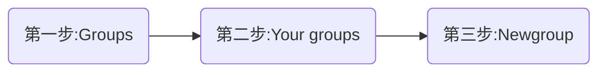
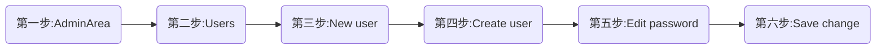
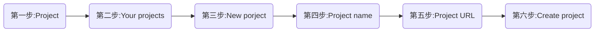
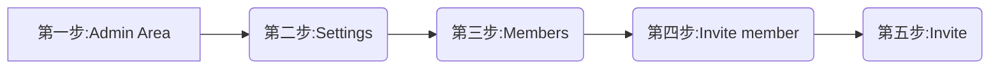
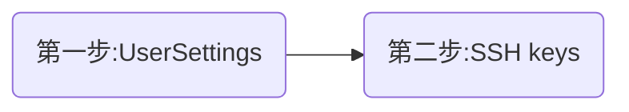
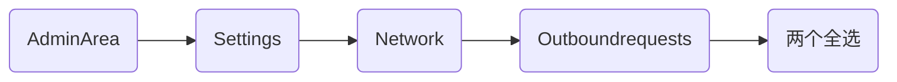
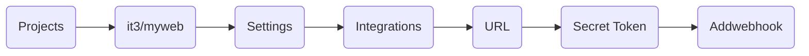

# gitlab&jenkins

## 环境准备

### 主机

| 用户    | 内存 | ip              |
| ------- | ---- | --------------- |
| gitlab  | >=4G | 192.168.168.134 |
| jenkins | >=1G | 192.168.168.133 |

### 环境

```sh
#gitlab主机安装docker
#在jenkins主机安装java环境
```

## Gitlab

### 安装

#### 修改宿主机ssh端口

```sh
#git的拉取有http和ssh两种形式，前者需要输入密码，所以采用后者，但是后者默认使用宿主机22端口映射进容器22端口
vim /etc/ssh/sshd_config
Port 2222
systemctl restart sshd
```

#### 启动容器

```sh
#为了方便，直接用社区版镜像安装（镜像已上传github托管仓库）
docker search gitlab
docker run -it \
-h gitlab \
--name gitlab \
-p 443:443 \
-p 80:80 \
-p 22:22 \
--restart  always \
-v /srv/gitlab/config/:/etc/gitlab/ \
-v /srv/gitlab/logs/:/var/log/gitlab/ \
-v /srv/gitlab/data/:/var/opt/gitlab/  \
-d gitlab/gitlab-ce:latest
#内容较多，多等待一会
```

### 面板设置

#### 登录gitlab

```sh
#登录gitlab
http://192.168.168.134
#初始化密码
8位以上
#登录
username : root
password : xxxxxxxx
```

#### 创建组



#### 创建用户



#### 创建项目



#### 邀请用户



```sh
#GitLab member or Email address  选择用户
#Choose a role permission	    角色权限（一般给Maintainer）
```

#### 添加公钥



```sh
#这里直接用root公钥/root/.ssh/id_rsa.pub粘贴进去即可
```

### 上传代码

#### Git全局设置

```sh
#在需要拉取的主机上进行全局设置
git config --global user.name 'Jerry'
git config --global user.email 'Jerry@163.com'
```

#### 创建一个新的仓库

```sh
git clone git@192.168.168.134:it3/myweb.git
cd myweb
touch README.md
git commit -m 'add README'
git push -u origin master
```

#### 推送现有文件夹

```sh
#先在gitlab上新建it3/myweb.git项目
#然后在本地主机上执行
cd myweb
git init
git remote add origin git@192.168.168.134:it3/myweb.git #添加远端仓库到本地，origin这里代表it3/myweb.git
git add .
git commit -m 'Initial commit'
git push -u origin master
```

#### 推送一个存在的git仓库

```sh
#先在gitlab上新建it3/myweb.git项目
cd myweb
git remote rename origin old-origin
如果出现以下报错，忽略
error: 不能重命名配置小节 'remote.origin' 到 'remote.old-origin'
git remote add origin git@192.168.168.134:it3/myweb.git
git push -u origin --all
git push -u origin --tags
```

## Jenkins

### 地址

```sh
#官网地址：https://jenkins.io/
#Jenkins官方包地址：https://pkg.jenkins.io/redhat-stable/
#refspec的官方详解地址：https://git-scm.com/book/en/v2/Git-Internals-The-Refspec
```

### 安装

```sh
#java环境
yum -y install java
#下载包
wget https://pkg.jenkins.io/redhat-stable/jenkins-2.204.5-1.1.noarch.rpm
#安装
yum -y install https://pkg.jenkins.io/redhat-stable/jenkins-2.204.5-1.1.noarch.rpm
#查看jenkins相关沐浴露
rpm -ql jenkins
#修改用户
vim /etc/sysconfig/jenkins
JENKINS_USER="root"		#将用户jenkins修改为root启动
#启动
systemctl restart jenkins
systemctl enable jenkins
```

3.3面板设置

#### 登录

```sh
#安装插件可以预装或者自定义，不用创建管理员账号，直接用admin账号登录即可，登陆后将管理员账号密码改掉
http://192.168.168.134:8080
```

#### 插件安装


```sh
#必要插件
Gitlab	#与Gitlab Hook依赖使用，否则安装了Gitlab Hook将不会在触发器显示出来
Gitlab Hook	#gitlab和jenkins实现自动化集成
Git Parameter  #参数设置，经常用来标签tag参数的设定
#其它相关插件
Build Authorization Token Root
Publish Over SSH
Gitlab Authentication
#安装完后直接重启即可
```

#### 创建工程

##### 创建项目


##### 配置项目

###### 不添加tag标签配置

```sh
#可以触发插件Gitlab Hook钩子
#General
不配置
#源码管理
git
	Repositories
		Repository URL	http://192.168.168.134/it3/myweb.git
		Credential		Jerry/12345678（全局凭据--Username with password）
		#高级设置
		Name			myweb
		Refspec			+refs/heads/master:refs/remotes/myweb/master
	Branches to build
		Branch Specifier (blank for 'any')		refs/remotes/myweb/master
	源码库浏览器	gitlab
    	URL	http://192.168.168.134/it3/myweb.git
    	Version	12.8 	#进容器 cat /opt/gitlab/embedded/service/gitlab-rails/VERSION
#构建触发器
	Build when a change is pushed to GitLab. 
		GitLab webhook URL: http://192.168.168.133:8080/project/myweb
		Secret token	20d799ec9b4eb12f5d1a34989ac42fdb     #Generate生成
#构建环境
不配置
#构建
执行shell（#注意这里免密的ssh key的添加）
	ssh 192.168.168.132 "rm -rf /usr/local/nginx/conf/promotion/*"
	scp -r /var/lib/jenkins/workspace/671/* root@192.168.168.132:/usr/local/nginx/conf/promotion/
	ssh 192.168.168.132 "tar -zcvf promotion-$(date +%F).tar.gz /usr/local/nginx/conf/promotion/*"
```

###### 添加tag标签配置

```sh
#不可以触发插件Gitlab Hook钩子，需要手动Build with Parameters
#General
	参数化构建过程
		Git Parameter	
			Name	webver		#名字随意起
			Description	 xxxx    #可选项
			Parameter Type  Tag	 #选Tag
			Default/Value	myweb/master   #一般写成origin/master就可以
#源码管理
git
	Repositories
		Repository URL	http://192.168.168.134/it3/myweb.git
		Credential		Jerry/12345678（全局凭据--Username with password）
		#高级设置
		Name			myweb
		Refspec			+refs/heads/master:refs/remotes/myweb/master
	Branches to build
		Branch Specifier (blank for 'any')		refs/remotes/myweb/master
	源码库浏览器	gitlab
    	URL	http://192.168.168.134/it3/myweb.git
    	Version	12.8 	#进容器 cat /opt/gitlab/embedded/service/gitlab-rails/VERSION	
    Additional Behaviours	检出到子目录
    	仓库的本地子目录	myweb-$webver		#这里恰好引用tag设置的变量webver
#构建触发器
	Build when a change is pushed to GitLab. 
		GitLab webhook URL: http://192.168.168.133:8080/project/myweb
		Secret token	a1f1df0daa470f4a3192d88c176f399a     #Generate生成
#构建环境
不配置
#构建
执行shell
	version_dir=/usr/local/nginx/version
	deploy_dir=/usr/local/nginx
	pkgs_dir=/usr/local/nginx/pkgs
	cp -r myweb-$webver $pkgs_dir
	cd $pkgs_dir
	rm -rf myweb-$webver/.git
	tar -zcf myweb-$webver.tar.gz myweb-$webver
	md5sum myweb-$webver.tar.gz | awk '{print $1}' > myweb-$webver.tar.gz.md5
	cd $deploy_dir
	ln -nfs  pkgs/myweb-$webver html	#这里的html不要在web主机创建
	cd $version_dir
	[ -f livever ] && cat livever > lastver 
	echo $webver > livever
```

##### Gitlab配置hook地址和token

###### root用户开启网络



###### Jerry用户配置hook/token



```sh
URL:				http://192.168.168.133:8080/project/myweb
Secret Token:		 20d799ec9b4eb12f5d1a34989ac42fdb
#最后test测试
	Push events
 	返回	Hook executed successfully: HTTP 200  代表成功
```


