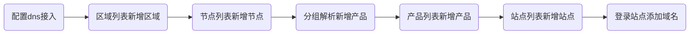
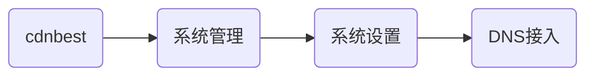
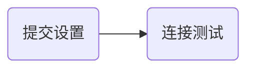
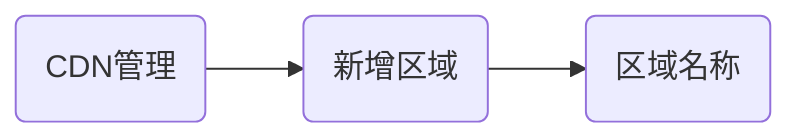
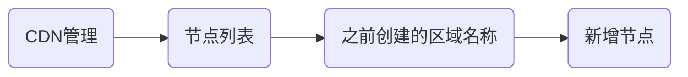
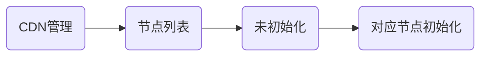
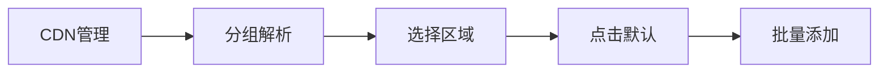
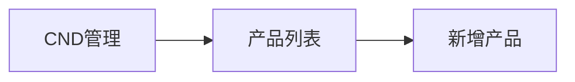
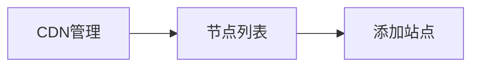

# CDNBSET快速部署自己的cdn平台

```sh
官文地址：https://help.cdnbest.com/index.php?title=Cdnbest%E9%83%A8%E7%BD%B2%E6%96%87%E6%A1%A3
```


## 准备工作

```sh
1.https://www.cdnbest.com注册账号		#bingyuantin@163.com
  https://www.dnsdun.com注册账号		#bingyuantin@163.com
2.准备一个域名调度CDN用得，域名一定要添加在DNSDUN做解析，这样智能DNS就能和CDN无缝对接，功能上完美契合
3.准备好CDN节点服务器，系统推荐linux-centos 64位，windows也支持
```

## 安装配置

### Cdnbest配置步骤流程图



### 第一步

#### DNSDUN

```sh
1.dnsdun上添加准备的调度用主域名
2.在账户设置中生成API_KEY
	UID:是dnsdun自动生成
	API_KEY:需要点击生成key，然后保存
	监控回调：https://console.cdnbest.com/system/monitor/callback/30660 #参照
```

#### CDNBEST



```sh
#DNS接入
DNS主域名：dnsdun添加主域名
默认TTL:600
DNS UID:dnsdun生成UID
API Key:dnsdun保存API
```



```sh
点击dns修复可以重新同步因网络原因没有及时更新同步的配置信息到dns解析
```

### 第二步

#### 新增区域



#### 新增节点



```sh
#新增节点，界面会有提示
1.linux服务器，直接运行下列脚本
yum -y install wget;wget --no-check-certificate https://www.cdnbest.com/public/install2.php?/3.8.6.30/30660/  -O cb.sh;sh ./cb.sh 30660
或者
wget https://github.com/bingyuantin163/mydocs/releases/download/cdnbest3.8.6.30/cb.sh;sh ./cb.sh 30660
2.windows服务器
按照系统下载对应安装包
```

#### 初始化节点



```sh
#对应节点初始化
区域：选择要初始化节点到那个区域
名字：设置节点的名字，只能用英文和数字
节点类型：选择默认的边缘节点就行了，中间节点是多层CDN功能（需vip4以上套餐支持）
备注：可留空
#初始化成功后，节点会显示在对应的区域中，显示版本号则表示节点连接主控后台正常
```

### 第三步

```sh
#分组解析
在分组解析中启用相应的节点ip(分组可自行新增，同一区域下的节点可在不同分组中共用）
```



```sh
#批量添加
勾选下面可选节点，点击批量添加，节点会显示在右边，表示已经启用
#注意
在分组中的解析值就为一级调度域名生成二级调度域名域名后，在dnsdun上的解析值
之后在dnsdun和cdn上添加的对应域名cname到此二级调度域名即可
```

### 第四步



```sh
#新增产品
产品名称：xxx
协议：七层	#指定站点协议，不可修改
指定区域：yyy
主分组：默认
七层站点功能：
	功能限制：
		    国际域名
		    ssl
		    自动ssl
		    访问日志
	cname模式：
		    站点
	默认状态：
		    正常
站点自用与出售模式：
		类型：
			自用
#七层主分组和副分组如果有多个是可以多选的，在新增站点时会随机指定一个主分组和副分组
```

### 第五步



```sh
#添加站点
站点名称：xxxx
站点密码：yyyy
产品选择：之前创建的产品
```

### 第六步

```sh
点击站点列表，点击站点名登录
```

### 第七步

```sh
添加域名
```


