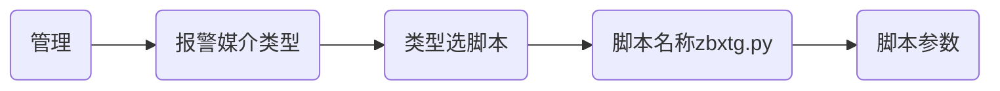
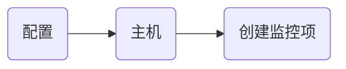
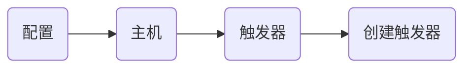

# 建立zabbix的Telegram报警机制

国外zabbix配置zabbix-in-Telegram，国内推荐使用钉钉，微信，QQ

## 申请Telegram机器人

申请机器人参考地址：

```
https://core.telegram.org/bots#creating-a-new-bot
```

1.1访问https://telegram.me/botfather，使用**/newbot**命令创建bot

1.2将生成的bot加入需要被告警的Tel群组，输入一些文本，稍后获取信息

1.3然后访问https://api.telegram.org/botXXX:YYY/getUpdates获取信息

```sh
#注意
XXX:YYY为给机器人取完名字之后的Use this token to access the HTTP API:
如   1188991876:AAEQw7CvKjSDlzsVjZ3tVNuOa51MZIB_a7w
https://api.telegram.org/bot1188991876:AAEQw7CvKjSDlzsVjZ3tVNuOa51MZIB_a7w/getUpdates
```

```shell
#关注访问内容中的这些内容
"chat":{"id":AAA,"title":"linshi123","type":"group","all_members_are_administrators":true},
```

```shell
如果获取到的内容中不含有上面的字段
如：{"ok":true,"result":[]}
可以将机器人从群中去除，然后重新拉入群中，重试即可
```

1.4type:group 为 Tle 的组, title 对应组名,id 为组 ID

1.5测试机器人是否正常

```shell
#在一台有外网的主机测试即可，
curl -X POST "https://api.telegram.org/botXXX:YYY/sendMessage" -d "chat_id=AAA&text=my test"
                                                                               text为发送内容
```

## 配置Zabbix-in-Telegram

2.1确认zabbix_server 的配置

```shell
AlertScriptsPath=/usr/lib/zabbix/alertscripts
```

2.2clone代码，安装依赖

```shell
git clone https://github.com/ableev/Zabbix-in-Telegram.git
yum -y install epel-release
yum -y install python-pip
cd Zabbix-in-Telegram/
pip install -r requirements.txt
没有python或者python-pip自行搜索安装
```

2.3复制告警脚本至配置路径

```shell
cp zbxtg.py zbxtg_settings.example.py zbxtg_group.py /usr/lib/zabbix/alertscripts/
cd /usr/lib/zabbix/alertscripts/
mv zbxtg_settings.example.py zbxtg_settings.py
```

2.4修改 zbxtg_settings.py

```shell
tg_key = "KEY"  # telegram bot api key  即 XXX:YYY 
zbx_server = "http://youip:port/zabbix"  # zabbix server full url
zbx_api_user = "Admin"     #可以登录的用户，并且有权限
zbx_api_pass = "zabbix"
```

2.5测试脚本是否可以正常发送警告

```shell
针对个人用户
./zbxtg.py  zabbix123456  "$bingyuantin_bot" "Test message" "Hello"
             目标用户        机器人username
```

```shell
针对用户组
./zbxtg.py  zabbix_domain_name_expire_check  "$zabbix_Jerry_bot"  "Hello"   --group
             	 		#组名        			#机器人username     #信息
```

## 配置 zabbix-server-web

3.1创建报警媒介类型Media types，3.0以上版本都需要配置



```sh
#脚本参数
{ALERT.SENDTO}
{ALERT.SUBJECT}
{ALERT.MESSAGE}
--group
```

3.2创建动作action


```sh
#创建动作
1.动作
名称：zabbix_Jerry_bot
计算方式：或
条件
	标签	名称	动作
	A	触发器示警度 等于 灾难	
	B	触发器示警度 等于 严重
	C	触发器示警度 等于 一般严重
	D	触发器示警度 等于 警告
	E	触发器示警度 等于 信息
2.操作
默认操作步骤持续时间：1m
默认标题：{{fire}}{{fire}}{{fire}}:告警节点:{TRIGGER.NAME}
消息内容：问题详情: {ITEM.NAME}:{ITEM.VALUE}
		告警时间: {EVENT.DATE} {EVENT.TIME}
		告警等级: {TRIGGER.SEVERITY}
		告警信息: {TRIGGER.NAME}
		告警项目: {TRIGGER.KEY1}
		当前状态: {TRIGGER.STATUS}.{ITEM.VALUE}
		事件ID: {EVENT.ID}
		zbxtg:graphs
		zbxtg:graphs_period=10800
		zbxtq:itemid:{ITEM.ID1}
		zbxtg:title:{HOST.HOST} - {TRIGGER.NAME}
操作：发送消息给用户群组: Zabbix administrators 通过 证书到期前10天
3.恢复操作
默认标题：{{OK}}{{OK}}{{OK}}:恢复节点:{TRIGGER.NAME}
消息内容：问题详情:  {ITEM.NAME}:{ITEM.VALUE}
		恢复主机:  {HOST.NAME}
		恢复时间:  {EVENT.DATE} {EVENT.TIME}
		事件等级:  {TRIGGER.SEVERITY}
		恢复项目:  {TRIGGER.KEY1}
		当前状态:  {TRIGGER.STATUS}.{ITEM.VALUE}
		事件ID:  {EVENT.ID}
		zbxtg:graphs
		zbxtg:graphs_period=10800
		zbxtq:itemid:{ITEM.ID1}
		zbxtg:title:{HOST.HOST} - {TRIGGER.NAME}
操作：发送消息给用户群组: Zabbix administrators 通过 证书到期前10天
```

## 配置用户User


```sh
#报警媒介
类型：证书到期前10天
收件人：zabbix_domain_name_expire_check   #telegram有机器人的组,一定不要写成机器人名字
```

## 自定义键值

### 配置设置

```sh
vim /etc/zabbix/zabbix_agentd.conf
AllowRoot=1
UnsafeUserParameters=1
UserParameter=ssl_expire_check,sh /root/ssl_expire_check.sh

#kill掉之前的zabbix_agent
#重启 zabbix_agentd
```

### 创建键值脚本

```sh
vim /root/ssl_expire_check.sh
#!/bin/bash
time_year=`date +%Y`
time_month=`date +%m`
time_day=`date +%d`
for i in $(cat /etc/ssl/certs/expire_time.txt)
do
    ssl_name=$(echo $i | awk -F'~' '{print $1}')
    ssl_year=$(echo $i | awk -F'~' '{print $2}')
    ssl_month=$(echo $i | awk -F'~' '{print $3}')
    ssl_day=$(echo $i | awk -F'~' '{print $4}')
    expire_days=`expr $ssl_day - $time_day`
        if [[ $time_year -lt $ssl_year ]]; then
           # echo "$ssl_name年份上未到期"
            continue
        elif [[ $time_month -lt $ssl_month ]]; then
           # echo "$ssl_name份月上未到期"
            continue
        elif [[ $expire_days -le 10 ]]; then
            echo "$ssl_name还有$expire_days天到期"
            continue
        fi
done
```

### 键值检测

```sh
yum -y install zabbix-get
[root@vm9 ~]# zabbix_get -s 127.0.0.1 -p 10050 -k ssl_expire_check
c2站内证书13103300.com还有5天到期
c3站内证书m.cxc26.com还有9天到期
c6站内证书v809a.com还有6天到期
c1站内测试证书还有6天到期
```

## zabbix添加监控项



```sh
#监控项
名称：证书到期检测
类型：Zabbix客户端
键值：ssl_expire_check  #需要输入
接口：127.0.0.1:10050
信息类型：文本
更新间隔：30s
自定义时间间隔：类型  间隔  间期
              灵活  50s   1-7，00:00-24:00
历史数据保留时间：90d
新的应用集：自定义键值
```

## 触发器

```sh
#为监控项添加触发器
```



```sh
名称：证书到期前10天检测
严重性：信息
表达式：
		监控项：Zabbix server 证书到期检测
		功能：
```


