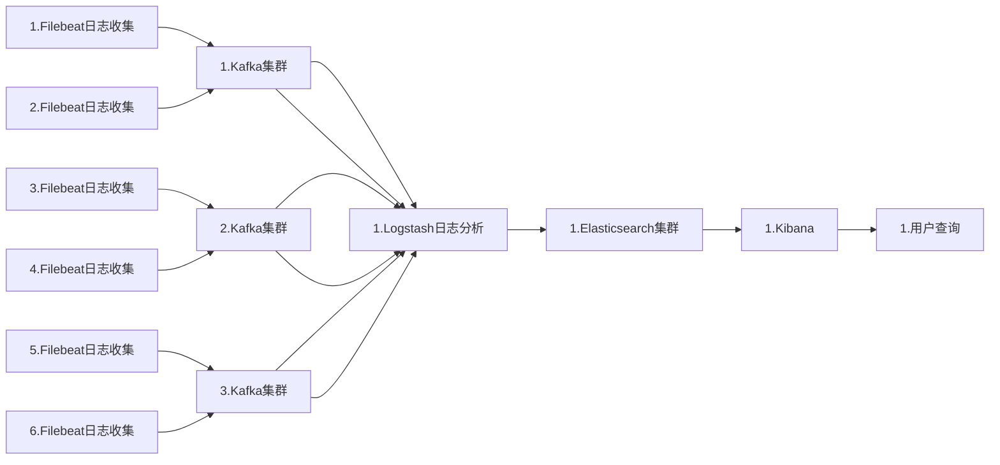

#  消息队列中间件

## 消息队列的应用场景

```sh
    消息队列中间件主要是分布式系统中的重要组件，主要解决异步消息，应用解耦，流量销峰等问题，从而实现高性能、高可用、可伸缩和最终一致性架构
```

### 异步处理

>```sh
>#场景说明：用户注册后需要发送注册邮件和注册短信
>```
>
>```sh
>2.引入消息队列：异步处理，注册消息写入数据库后即返回客户端注册成功
>```
>

### 应用解耦

>```sh
>#场景说明：用户下单后，下单系统需要通知库存系统
>```
>
>```sh
>1.传统做法：订单系统调用库存系统接口，待库存系统正确返回给订单系统，订单系统才会返回客户端下单成功
>     缺点：假如库存系统无法访问，订单减库存将失败，从而下单失败，订单系统与库存系统耦合	
>```
>
>```sh
>2.引入消息队列：
>订单系统：用户下单后，订单系统完成持久化处理，将消息写入队列，就可返回用户，下单成功
>库存系统：订阅下单消息，获取下单信息，库存消息根据下单信息，进行库存操作
>  假如：下单时库存系统不能正常使用，也不会影响正常下单。因为下单后，系统写入消息队列后就不再关心后续操作了
>    实现订单系统与库存系统的应用解耦	
>  ```
>     

### 流量销峰

>```sh
>#应用场景：秒杀活动一般因为流量过大，导致流量暴增，应用挂掉
>```
>
>```sh
>1.引入消息队列：
>  可以控制活动人数、可以缓解短时间内高流量压垮应用
>  用户请求，服务器接收后，先写入消息队列，假如消息队列超过最大数量，则直接抛弃用户或返回错误页面
>  秒杀业务根据消息队列中的请求消息，再做后续处理	
>```
>

## 消息队列主要用来解决那些问题

### Publish/Subscribe

>```sh
>订阅发布是消息中间件最基本功能
>```

### Message Priority

>```sh
>  RocketMQ所有消息都是持久化的，所以按照优先级来排序，开销会非常大，因此RocketMQ没有特意支持消息优先级
>  但是可以通过变通的方式实现类似功能，即单独配置一个优先级高的队列，和一个普通优先级别队列，将不同优先级
>  发送到不同队列即可
>  	1.只要达到优先级别目的即可，不是严格意义上的优先级，通常将优先级分为高、中、低或者再多几个级别，每个		  优先级可以用不同topic来表示，发消息时，指定不同topic来表示优先级，这种方式可以解决大部分的优先级		  问题，但是对业务优先级精确性做了拖鞋
>  	2.严格的优先级，用整数0~65535表示，这种优先级问题一般用不同topic解决就非常不合适。如果要让MQ解决此	   问题，会对MQ性能造成非常大的影响。需要明确一点，业务上是否确实需要这种严格的优先级，如果将优先级压	   缩成几个，对业务影响有多大
>```

### 2.3Message Order

>```sh
>  消息有序指的是一类消息消费时，能按照发送的顺序来消费。
>  如：一个订单产生三条消息，分别是订单创建，订单付款，订单完成。消费时，按照这个顺序消费才有意义，单同时订	   单直接可以并行消费。
>  RocketMQ可以严格保证消息有序
>```

### Message Filter

>```sh
>  	1.Broker端消息过滤
>  		在Broker中，按照Consumer的要求做过滤，优点是减少了对于Consumer无用消息的网络传输
>  		缺点是增加了Broker的负担，实现相对复杂
>  	2.Consumer端消息过滤
>  		这种过滤方式可由应用完全自定义实现，但是缺点是很多无用的消息要传输到Consumer端
>```

### Message Persistence

>```sh
>#消息中间件通常采用的几种持久化方式
>	1.持久化到数据库，例如Mysql
>	2.持久化到KV存储，例如levelDB、伯克利DB等KV存储系统
>	3.文件记录形式持久化，例如Kafka，RocketMQ
>	4.对内存数据做一个持久化镜像，例如beanstalkd，VisiNotify
>	5.RocketMQ充分利用Linux文件系统内存cache来提高性能
>```

### Message Reliablity

>```sh
>#影响消息可靠性的几种情况：
>	1.Broker正常关闭
>	2.Broker异常Crash
>	3.OS Crash
>	4.机器掉电，但是能立即恢复供电情况
>	5.机器无法开机（可能是cpu、主板、内存等关键设备损坏）
>	6.磁盘设备损坏
>#(1)、(2)、(3)、(4)四种情况都属于硬件资源可立即恢复情况，RocketMQ在这四种情况下能保证消息不丢，或者丢失少量数据
>
>#(5)、(6)属于单点故障，且无法恢复，一旦发生，在此单点上的消息全部丢失。RocketMQ在这两种情况下，通过异步复制，可保证99%的消息不丢，但是仍然会有极少量的消息可能丢失。通过同步双写技术可以完全避免单点，同步双写势必会影响性能，适合对消息可靠性要求极高的场合，例如与Money相关的应用,RocketMQ从3.0版本开始支持同步双写.
>```

### Low Latency Messaging

>```sh
>在消息不堆积情况下，消息到达Broker后，能立刻到达Consumer
>RocketMQ使用长轮询Pull方式，可保证消息非常实时，消息实时性不低于Push
>```

### At least Once

>```sh
>#是指每个消息必须投递一次
>RocketMQ Consumer先pull消息到本地，消费完成后，才向服务器返回ack，如果没有消费一定不会ack消息，所以RocketMQ可以很好的支持此特性
>```

### Exactly Only Once

>```sh
>1.发送消息阶段，不允许发送重复的消息
>2.消费消息阶段，不允许消费重复的消息
>#只有以上两个条件都满足情况下，才能认为消息是“Exactly Only Once”，而要实现以上两点，在分布式系统环境下，不可避免要产生巨大的开销。所以RocketMQ为了追求高性能，并不保证此特性，要求在业务上进行去重，也就是说消费消息要做到幂等性。RocketMQ虽然不能严格保证不重复，但是正常情况下很少会出现重复发送、消费情况，只有网络异常，Consumer启停等异常情况下会出现消息重复
>```

### Broker的Buffer满了怎么办？

>```sh
>Broker的Buffer通常指的是Broker中一个队列的内存Buffer大小，这类Buffer通常大小有限，如果Buffer满了以后怎么办？
>	1.RocketMQ没有内存Buffer概念，RocketMQ的队列都是持久化磁盘，数据定期清除
>	2.RocketMQ同其他MQ有非常显著的区别，RocketMQ的内存Buffer抽象成一个无限长度的队列，不管有多少数据进来都能装得下，这个无限是有前提的，Broker会定期删除过期的数据，例如Broker只保存3天的消息，那么这个Buffer虽然长度无限，但是3天前的数据会被从队尾删除
>#此问题的本质原因是网络调用存在不确定性，即既不成功也不失败的第三种状态，所以才产生了消息重复性问题
>```

### 回溯消费

>```sh
>#回溯消费是指Consumer已经消费成功的消息，由于业务上需求需要重新消费，要支持此功能，Broker在向Consumer投递成功消息后，消息仍然需要保留。并且重新消费一般是按照时间维度，例如由于Consumer系统故障，恢复后需要重新消费1小时前的数据，那么Broker要提供一种机制，可以按照时间维度来回退消费进度。
>
>RocketMQ支持按照时间回溯消费，时间维度精确到毫秒，可以向前回溯，也可以向后回溯。
>```

### 消息堆积

>```sh
>#消息中间键的主要功能是：
>1.异步解耦
>2.挡住前端的数据，保证后端系统的稳定性
>#要求消息中间键拥有一定的消息堆积能力：
>1.消息堆积在内存buffer，一旦超过内存buffer，可以根据一定的丢弃策略来丢弃消息，如CORBA Notification规范
>中描述，适合能容忍丢弃消息的业务，这种情况消息的堆积能力主要在于内存的buffer大小，而且消息堆积后，性能下降
>不会太大，因为内存中的数据多少对于对外提供的访问能力影响有限
>2.消息堆积能持久化存储系统中，例如DB,KV存储，文件记录形式.当消息不能在内存Cache命中时，要不可避免的访问磁
>盘，会产生大量读IO，读IO的吞吐量直接决定了消息堆积后的访问能力
>#评估消息堆积能力
>1.消息堆积多少条，多少字节？即消息堆积容量
>2.消息堆积后，发消息的吞吐量大小，是否会受堆积影响
>3.消息堆积后，正常消费的Consumer是否会受影响
>4.消息堆积后，访问堆积在磁盘的消息时，吞吐量多大
>```
>

### 分布式事务

```sh
已知的几个分布式事务规范，如XA，JTA等。其中XA规范被各大数据库厂商广泛支持，如Oracle，Mysql等，其中XA的TM实现佼佼
者如Oracle Tuxedo，在金融、电信等领域被广泛应用
#分布式事务涉及到两个阶段提交问题
在数据存储方面必然需要KV存储的支持，因为第二阶段的提交回滚需要修改消息状态，一定涉及到根据key去查找Message的动作，
RocketMQ在第二阶段绕过了根据Key去查找Message的问题，采用第一阶段发送Prepared消息时，拿到了消息的Offset，第二阶
段通过Offset去访问消息，并修改状态，Offset就是数据的地址

RocketMQ这种实现事务的方式，没有通过KV存储做，而是通过Offset方式，存在一个显著缺陷，即通过Offset更改数据，会令系
统的脏页过多，需要特别关注
```

### 定时消息

```sh
#定时消息
是指消息发送到Broker后，不能立刻被Consumer消费，要到特定的时间点或者等待特定的时间后才能被消费
如果要支持任意的时间精度，在Broker层面，必须要做消息排序，如果在涉及到持久化，那么消息排序要不可避免的产生巨大性能
开销
RoketMQ支持定时消息，但是不支持任意时间精度，支持特定的level，例如定时5s，10s，1m等
```

### 消息重试

```sh
#Consumer消费消息失败后，要提供一种重试机制，令消息再消费一次，Consumer消费消息失败通常可以认为有以下几种情况：

```


## rocketmq环境部署

### 主机环境

| HOST | IP            | SERVER   |      |
| ---- | ------------- | -------- | ---- |
| vm6  | 192.168.220.6 | rocketmq |      |
| vm7  | 192.168.220.7 | rocketmq |      |
| vm8  | 192.168.220.8 | rocketmq |      |

### 服务环境

```sh
1.#需要登录相应的oracle账户,下载java包
首页 https://www.oracle.com/cn/java/technologies/javase-jdk8-downloads.html
jdk-8u251-linux-x64.tar.gz  下载到本地，然后上传到linux服务器上
2.#解压
tar -zxvf jdk-8u251-linux-x64.tar.gz
mkdir /usr/local/java
mv jdk1.8.0_251/*  /usr/local/java/
3.#设置环境变量
export JAVA_HOME=/usr/local/java
export JRE_HOME=$JAVA_HOME/jre
export CLASSPATH=.:$JAVA_HOME/lib:$JRE_HOME/lib
export PATH=$JAVA_HOME/bin:$PATH
source /etc/profile
which java
```

### 下载安装

#### 安装mvn

```sh
1.#下载mvn
wget https://apache.01link.hk/maven/maven-3/3.6.3/binaries/apache-maven-3.6.3-bin.tar.gz
tar -xf apache-maven-3.6.3-bin.tar.gz -C /usr/local/
2.#设置环境变量
export MAVEN_HOME=/usr/local/apache-maven-3.6.3 
export PATH=$PATH:$MAVEN_HOME/bin
source /etc/profile
which mvn
/usr/local/apache-maven-3.6.3/bin/mvn  --version

```

#### 安装rocketmq

```sh
1.#获取reocketmq
wget https://archive.apache.org/dist/rocketmq/4.6.0/rocketmq-all-4.6.0-source-release.zip
unzip rocketmq-all-4.6.0-source-release.zip
cd rocketmq-all-4.6.0-source-release
2.#使用mvn编译
mvn -Prelease-all -DskipTests clean install -U
3.#把所编译的目录放到指定位置
mkdir -p /data/rocketmq
cd distribution/target/rocketmq-4.6.0/rocketmq-4.6.0/
cp -r  * /data/rocketmq
scp conf/2m-noslave/broker-a.properties vm7:/data/rocketmq/conf/2m-noslave/broker-a.properties 
scp conf/2m-noslave/broker-a.properties vm8:/data/rocketmq/conf/2m-noslave/broker-a.properties 
4.#启动mqnamesrv
nohup sh /data/rocketmq/bin/mqnamesrv &
nohup sh /data/rocketmq/bin/mqbroker -c /data/rocketmq/conf/2m-noslave/broker-a.properties &
（虚拟机上搭建这里可能出现Cannot allocate memory错误，需要在修改runbroker.sh中的内存设置）
（JAVA_OPT="${JAVA_OPT} -server -Xms256m -Xmx256m -Xmn125m" #根据本机内存改为适合自己的大小即可）
5.#列出集群信息
sh /data/rocketmq/bin/mqadmin clusterList -n 192.168.220.6:9876
```

#### 删除所有topic	

```sh
1. 停止rocketmq
可以使用kill -9 命令强制停止rocketmq进程
2. 删除rocketmq日志
rm -rf /root/logs/rocketmqlogs/*
3. 删除rocketmq中topic等信息
rm -rf /root/store/*
4.重启服务
PS:
1. 顺序必须是先停止rocketmq,再清空数据；如果顺序错误，可能会导致消息无法正常清除、rocketmq无法启动等问题
2. 删除Topic不是必须的，但是删除的时候需要指定 -c，可以用服务器的hostname试试
3. 添加topic和group
sh mqadmin updateTopic -c DefaultCluster -n 'ip:9876;ip:9876;ip:9876' -t pay_to_es_topic -r 16 -w 16
sh mqadmin updateSubGroup -c DefaultCluster -n 'ip:9876;ip:9876;ip:9876' -g pay_to_es_group
```

#### 控制台(可选)

```sh
#RocketMQ Console
主要是针对RocketMQ所做的一个界面管理工具，方便后期的运维管理，查看当前的MQ使用情况，包括Producer、Consumer、
Broker、Topic甚至Msg的管理。当然了，如果你比较喜欢命令行的形式也可以使用bin目录下的mqadmin来去管理
```

```sh
1.#安装控制台
git clone -b release-rocketmq-console-1.0.0 https://github.com/apache/rocketmq-externals.git
或者
wget https://github.com/bingyuantin163/mydocs/releases/download/1.0.0/rocketmq-externals-rocketmq-console-1.0.0.tar.gz
2.#控制台配置文件
cd rocketmq-externals/rocketmq-console/src/main/resources/
vim application.properties
3.#编译安装
#这里需要在pom.xml所在的目录下执行，这里是/root/rocketmq-externals-rocketmq-console-1.0.0/rocketmq-console
mvn clean package -Dmaven.test.skip=true
cp target/rocketmq-console-ng-1.0.0.jar /data/rocketmq/
nohup java -jar /data/rocketmq/rocketmq-console-ng-1.0.0.jar &
4.#访问控制台
http://192.168.220.6:8080
5.#容器方式(可尝试容器化部署)
docker pull styletang/rocketmq-console-ng
docker run -d -e "JAVA_OPTS=-Drocketmq.namesrv.addr=127.0.0.1:9876 -Dcom.rocketmq.sendMessageWithVIPChannel=false" -p 8080:8080 -t styletang/rocketmq-console-ng 
6.#将127.0.0.1修改为nameserver地址
```

#### 配置文件

```sh
1.cat  /data/rocketmq/conf/2m-noslave/broker-a.properties
# Licensed to the Apache Software Foundation (ASF) under one or more
# contributor license agreements.  See the NOTICE file distributed with
# this work for additional information regarding copyright ownership.
# The ASF licenses this file to You under the Apache License, Version 2.0
# (the "License"); you may not use this file except in compliance with
# the License.  You may obtain a copy of the License at
#
#     http://www.apache.org/licenses/LICENSE-2.0
#
# Unless required by applicable law or agreed to in writing, software
# distributed under the License is distributed on an "AS IS" BASIS,
# WITHOUT WARRANTIES OR CONDITIONS OF ANY KIND, either express or implied.
# See the License for the specific language governing permissions and
# limitations under the License.
brokerClusterName=DefaultCluster
# 其他节点换成 broker-b，broker-c
brokerName=broker-a
brokerId=0
deleteWhen=04
fileReservedTime=120
brokerRole=ASYNC_MASTER
flushDiskType=ASYNC_FLUSH
namesrvAddr=192.168.220.6:9876;192.168.220.7:9876;192.168.220.8:9876

2.cat rocketmq-externals-rocketmq-console-1.0.0/rocketmq-console/src/main/resources/application.properties
server.contextPath=
server.port=8080
#spring.application.index=true
spring.application.name=rocketmq-console
spring.http.encoding.charset=UTF-8
spring.http.encoding.enabled=true
spring.http.encoding.force=true
logging.config=classpath:logback.xml
#if this value is empty,use env value rocketmq.config.namesrvAddr  NAMESRV_ADDR | now, you can set it in ops page.default localhost:9876
rocketmq.config.namesrvAddr=192.168.220.6:9876;192.168.220.7:9876;192.168.220.8:9876
#if you use rocketmq version < 3.5.8, rocketmq.config.isVIPChannel should be false.default true
rocketmq.config.isVIPChannel=
#rocketmq-console's data path:dashboard/monitor
rocketmq.config.dataPath=/tmp/rocketmq-console/data
#set it false if you don't want use dashboard.default true
rocketmq.config.enableDashBoardCollect=true
```

#### 配置详解

```sh
#所属集群名字
brokerClusterName=rocketmq-cluster
#broker名字，注意此处不同的配置文件填写的不一样，a.properties,就写broker-a，b的就填写b
brokerName=broker-a
#0 表示 Master，>0 表示 Slave
brokerId=0
#nameServer地址，分号分割
namesrvAddr=rocketmq-nameserver1:9876;rocketmq-nameserver2:9876;rocketmq-nameserver3:9876
#在发送消息时，自动创建服务器不存在的topic，默认创建的队列数
defaultTopicQueueNums=4
#是否允许 Broker 自动创建Topic，建议线下开启，线上关闭
autoCreateTopicEnable=true
#是否允许 Broker 自动创建订阅组，建议线下开启，线上关闭
autoCreateSubscriptionGroup=true
#Broker 对外服务的监听端口
listenPort=10911
#删除文件时间点，默认凌晨 4点
deleteWhen=04
#文件保留时间，默认 48 小时
fileReservedTime=120
#commitLog每个文件的大小默认1G
mapedFileSizeCommitLog=1073741824
#ConsumeQueue每个文件默认存30W条，根据业务情况调整
mapedFileSizeConsumeQueue=300000
#destroyMapedFileIntervalForcibly=120000
#redeleteHangedFileInterval=120000
#检测物理文件磁盘空间
diskMaxUsedSpaceRatio=88
#存储路径
storePathRootDir=/mnt/store
#commitLog 存储路径
storePathCommitLog=/mnt/store/commitlog
#消费队列存储路径存储路径
storePathConsumeQueue=/mnt/store/consumequeue
#消息索引存储路径
storePathIndex=/mnt/store/index
#checkpoint 文件存储路径
storeCheckpoint=/mnt/store/checkpoint
#abort 文件存储路径
abortFile=/mnt/store/abort
#限制的消息大小
maxMessageSize=65536
#flushCommitLogLeastPages=4
#flushConsumeQueueLeastPages=2
#flushCommitLogThoroughInterval=10000
#flushConsumeQueueThoroughInterval=60000 
#Broker 的角色
#- ASYNC_MASTER 异步复制Master
#- SYNC_MASTER 同步双写Master
#- SLAVE
brokerRole=ASYNC_MASTER
#刷盘方式
#- ASYNC_FLUSH 异步刷盘
#- SYNC_FLUSH 同步刷盘
flushDiskType=ASYNC_FLUSH
#checkTransactionMessageEnable=false
#发消息线程池数量
#sendMessageThreadPoolNums=128
#拉消息线程池数量
#pullMessageThreadPoolNums=128
brokerIP1=172.16.150.134 #绑定本地IP，如果主机有多块网卡则需要配置，否则报错
```

## rabbitmq环境部署

```sh

```

## FileBeats+Kafka+ELK集群架构

### 架构图

#### 大型集群架构



#### kafka流程架构


| 对象           | 说明                         |
| -------------- | ---------------------------- |
| producer       | 生产者，向主题发布消息的应用 |
| broker         | 主机节点                     |
| topic          | 主题，承载消息               |
| partition      | 分区，用于主题分片存储       |
| consumer group | 消费者组，由多个消费者组成   |
| consumer       | 消费者，从主题订阅消息的应用 |

### 说明

```sh
#这里借elk日志收集系统来模拟kafka系统
	logstash其功能虽然强大，但是它依赖java，在数据量大的时候，logstash进程会消耗过多的系统资源，这将严重影响业务
系统的性能，而filebeat就是一个完美的替代者，它是基于go语言，没有任何依赖，配置文件简单，格式明了，同时filebeat比
logstash更加轻量，所以占用 系统资源极少，个非常适合安装在生产机器上，推荐使用filebeat，也是ELK stack在Agent的第
一选择
	此架构适合大型集群，海量数据的业务场景，它通过将前端的logstash agent替换成filebeat，有效降低了收集日志对业务
系统资源的消耗，同时，消息队列使用kafka集群架构，有效保障收集数据的安全性和稳定性，后端的logstash和elasticsearch
均采用集群模式，从整体上提高了ELK系统的高效性，扩展性和吞吐量
```

### 搭建部署

#### 环境准备

```sh
所有设备安装jdk
https://www.oracle.com/technetwork/java/javase/downloads/index.html下载jdk tar包
cd /data/package
tar -zxf  jdk-8u181-linux-x64.tar.gz
配置环境变量
vim /etc/profile
export JAVA_HOME=/data/jdk
export JRE_HOME=$JAVA_HOME/jre
export CLASSPATH=CLASSPATH=.:$JAVA_HOME/lib/dt.jar:$JAVA_HOME/lib/tools.jar
export PATH=$JAVA_HOME/bin:$PATH
使其生效  source /etc/profile
验证：java -version
     jps
```

#### zookeeper集群安装

```sh
1.下载(#这里尽量下载已经编译过的带bin的二进制包)
#官网 https://zookeeper.apache.org/
wget https://downloads.apache.org/zookeeper/zookeeper-3.6.1/apache-zookeeper-3.6.1-bin.tar.gz
tar -xf apache-zookeeper-3.6.1-bin.tar.gz
mkdir /etc/zookeeper/
cp -r  apache-zookeeper-3.6.1-bin/* /etc/zookeeper/
cd /etc/zookeeper/
cp zoo_sample.cfg zoo.cfg
2.配置（#所有节点）
mkdir /etc/zookeeper/data/

vim /etc/zookeeper/conf/zoo.cfg
tickTime=2000
initLimit=10
syncLimit=5
dataDir=/etc/zookeeper/data/
dataLogDir=/etc/zookeeper/log/
clientPort=2181
server.1=192.168.220.6:2888:3888
server.2=192.168.220.7:2888:3888
server.3=192.168.220.8:2888:3888

vim /etc/zookeeper/data/myid
#根据server.1 server.2 server.3填写不同主机的myid值分别为1 2 3 
4.#这里需要主要防火墙和端口信息
其中防火墙未关闭或者端口未关闭，导致服务报错Error contacting service. It is probably not running
端口只有leader 会监听2888端口，进行集群内部通信，2181个3888集群中的所有主机都会监听
3.启动
添加环境变量
vim /etc/profile  &&  vim /etc/bashrc
export ZK_HOME=/etc/zookeeper
export PATH=$ZK_HOME/bin:$PATH
source /etc/profile  &&  source /etc/bashrc
**注释**
/etc/profile  //交互式全局环境变量配置文件
/etc/bashrc   /非交互式全局环境变量配置文件，自动化远程执行脚本用到此配置文件
cd /etc/zookeeper/bin/
zkServer.sh start  /etc/zookeeper/conf/zoo.cfg
zkServer.sh status
4.#这里需要主要防火墙和端口信息
其中防火墙未关闭或者端口未关闭，导致服务报错Error contacting service. It is probably not running
端口只有leader 会监听2888端口，进行集群内部通信，2181个3888集群中的所有主机都会监听
5.#zk查看相关注册服务
```

#### kafka集群安装

```sh
#kafka中一些概念理解
1.kafka最初由Linkedin公司开发，是一个分布式、分区的、多副本的、多订阅者，基于zookeeper协调的分布式日志系统，也可
以当做MQ系统，常见可以用于web/nginx日志、访问日志、消息服务等等，Linkedin于2010年贡献给了Apache基金并成为顶级开
源项目
2.kafka部分重要名词解释
	broker：消息中间件处理节点，一个kafka节点就是一个broker，多个broker可以组成一个kafka
	topic：一类消息，例如page view日志、click日志等都可以以topic的形式存在，kafka能同时负责多个topic发布
	partition：topic物理上的组，一个topic可以分为多个partition，每个partition是一个有序队列
	segment：partition物理上由多个semgent组成，每个partition（目录）相当于一个巨型文件被分配到多个大小相等
			segment（段落）数据文件中，但每个段segment file的消息数量不一定相等，这种特性方便old segment
             file快速被删除，segment文件生命周期由服务端配置参数决定
 	segment file：由两大部分组成，分别为index file和data file，此两个文件一一对应，成对出现，后缀“.index”和
 		         “.log”分别为segment索引文件、数据文件，partition全局的第一个segment从0开始，后续每个segment
 		         文件名为上一个segment文件最后一条消息的offset值，数值最大为64位long大小，19位数字字符长度，没
 		         有数字用0填充
	offset：每个partition都由一系列有序的、不可变的消息组成，这些消息被连续追加到partition中，partition中的每
		   个消息都有一个连续的序列号叫做offset，用于partition唯一标识一条消息
3.kafka中的topic为什么要分为多个partition
	topic是逻辑概念，partition是物理概念，对用户来说是透明的。但是producer只关心消息发往哪个topic，而consumer
只关心自己订阅哪个topic，并不关心每条消息存于整个集群的哪个broker
	为了性能考虑，如果topic中的消息只存于一个broker上，那么这个broker会成为瓶颈，无法做到水平扩展。因此把topic的
数据分布到整个集群就是一个相对合理的方案，partition的引入就是为了解决水平扩展的问题
	partition可以被理解为一个无限长度的数组，新数据顺序追加进这个数组。物理上，一个partition对应一个文件夹，一个
broker上可以存放多个partition，这样producer将数据发送给多个broker上的partition，consumer可以并行从多个broker
上的partition上读数据，实现水平扩展
```

| 配置项                          | 配置项                         | 配置项                                               |
| ------------------------------- | ------------------------------ | ---------------------------------------------------- |
| broker.id                       | 0                              | Broker唯一标识                                       |
| listeners                       | PLAINTEXT://192.168.88.53:9092 | 监听信息，PLAINTEXT表示明文传输                      |
| log.dirs                        | kafka/logs                     | kafka数据存放地址，可以填写多个。用”,”间隔           |
| message.max.bytes               | message.max.bytes              | 单个消息长度限制，单位是字节                         |
| num.partitions                  | 1                              | 默认分区数                                           |
| log.flush.interval.messages     | Long.MaxValue                  | 在数据被写入到硬盘和消费者可用前最大累积的消息的数量 |
| log.flush.interval.ms           | Long.MaxValue                  | 在数据被写入到硬盘前的最大时间                       |
| log.flush.scheduler.interval.ms | Long.MaxValue                  | 检查数据是否要写入到硬盘的时间间隔                   |
| log.retention.hours             | 24                             | 控制一个log保留时间，单位：小时                      |
| zookeeper.connect               | 192.168.88.21:2181             | ZooKeeper服务器地址，多台用”,”间隔                   |

```sh
#官网：https://kafka.apache.org/
1.下载
wget http://mirror.rise.ph/apache/kafka/2.4.1/kafka_2.12-2.4.1.tgz
tar -xf kafka_2.12-2.4.1.tgz
mkdir /etc/kafka
mv  kafka_2.12-2.4.1/*  /etc/kafka/
2.配置（#每个节点配置时注意配置调整）
vim /etc/kafka/server.properties
broker.id=0	#broker唯一标识
listeners=PLAINTEXT://192.168.220.7:9092 #监听信息，PLAINTEXT表示明文传输
num.network.threads=3
num.io.threads=8
socket.send.buffer.bytes=102400
socket.receive.buffer.bytes=102400
socket.request.max.bytes=104857600
log.dirs=/etc/kafka/logs/	#kafka数据存放地址，可以写多个，用逗号隔开
num.partitions=1    #默认分区数
num.recovery.threads.per.data.dir=1
offsets.topic.replication.factor=1
transaction.state.log.replication.factor=1
transaction.state.log.min.isr=1
log.retention.hours=168
log.segment.bytes=1073741824
log.retention.check.interval.ms=300000
zookeeper.connect=192.168.220.6:2181,192.168.220.7:2181,192.168.220.8:2181	#zk集群地址
zookeeper.connection.timeout.ms=6000
group.initial.rebalance.delay.ms=0
3.添加环境变量
vim /etc/profile
export KAFKA_HOME=/etc/kafka
export PATH=$KAFKA_HOME/bin:$PATH
source /etc/profile
#linux下环境变量补救
正常服务器的下查看  echo $PATH
在不正常服务器下：export `echo $PATH`
4.启动
kafka-server-start.sh -daemon  /etc/kafka/config/server.properties
nohup kafka-server-start.sh   /etc/kafka/config/server.properties &
5.测试
#注明：在创建topic时候，从kafka 2.2版本开始，将参数--zookeeper替换成--bootstrap-server，--zookeeper已经被标
      #注为“已过期”，因此，使用2.2及以上版本创建主题指定--bootstrap-server参数
#简析使用--bootstrap-server而非--zookeeper的两个主要原因
###第一：使用--zookeeper会绕过kafka的安全体系，即使你为kafka集群设置了安全认证，限制主题创建，使用--zookeeper
        #参数，依然能够创建任意主题，不受认证体系的约束，这显然是kafka集群运维人员不愿意看到的
###第二：使用--bootstrap-server与集群进行交互，越来越成为kafka的标准姿势，以后会越来越少的命令和API需要与ZK进行
        #连接，这样我们需要一套连接信息，就能与kafka进行全方位交互，不用像以前一样，必须同时维护ZK和Broker的连接
        #信息了
#创建topic
[root@vm7 bin]# kafka-topics.sh --create --topic test01 --bootstrap-server 192.168.220.7:9092 --replication-factor 3 --partitions 3 
#查看topic
[root@vm7 bin]# kafka-topics.sh --list --bootstrap-server 192.168.220.7:9092
test01
[root@vm7 bin]# kafka-topics.sh --list --bootstrap-server 192.168.220.8:9092
test01
[root@vm7 bin]# kafka-topics.sh --list --bootstrap-server 192.168.220.9:9092
test01
[root@vm7 bin]# kafka-topics.sh --describe --topic test01  --bootstrap-server 192.168.220.7:9092
Topic: test01	PartitionCount: 3	ReplicationFactor: 3	Configs: segment.bytes=1073741824
	Topic: test01	Partition: 0	Leader: 1	Replicas: 1,0,2	Isr: 1,0,2
	Topic: test01	Partition: 1	Leader: 0	Replicas: 0,2,1	Isr: 0,2,1
	Topic: test01	Partition: 2	Leader: 2	Replicas: 2,1,0	Isr: 2,1,0
[root@vm7 bin]# kafka-topics.sh --describe --topic test01  --bootstrap-server 192.168.220.8:9092
Topic: test01	PartitionCount: 3	ReplicationFactor: 3	Configs: segment.bytes=1073741824
	Topic: test01	Partition: 0	Leader: 1	Replicas: 1,0,2	Isr: 1,0,2
	Topic: test01	Partition: 1	Leader: 0	Replicas: 0,2,1	Isr: 0,2,1
	Topic: test01	Partition: 2	Leader: 2	Replicas: 2,1,0	Isr: 2,1,0
[root@vm7 bin]# kafka-topics.sh --describe --topic test01  --bootstrap-server 192.168.220.9:9092
Topic: test01	PartitionCount: 3	ReplicationFactor: 3	Configs: segment.bytes=1073741824
	Topic: test01	Partition: 0	Leader: 1	Replicas: 1,0,2	Isr: 1,0,2
	Topic: test01	Partition: 1	Leader: 0	Replicas: 0,2,1	Isr: 0,2,1
	Topic: test01	Partition: 2	Leader: 2	Replicas: 2,1,0	Isr: 2,1,0
#发送消息
这里我们向Broker(id=0)的topic=test01发送消息
[root@vm7 bin]# kafka-console-producer.sh  --broker-list 192.168.220.7:9092 --topic test01
>this is a test message for topic test01
然后查看数据目录
[root@vm7 test01-1]# ll
total 8
-rw-r--r-- 1 root root 10485760 May 14 03:48 00000000000000000000.index
-rw-r--r-- 1 root root      107 May 14 04:17 00000000000000000000.log
-rw-r--r-- 1 root root 10485756 May 14 03:48 00000000000000000000.timeindex
-rw-r--r-- 1 root root        8 May 14 03:48 leader-epoch-checkpoint
[root@vm7 test01-1]# cat 00000000000000000000.log 
_~`r¯rr¯rÿÿÿÿÿÿÿÿÿÿÿÿÿÿZNthis is a test message for topic test01
#消费消息
在kafka02上消费broker03的消息
[root@vm8 bin]# kafka-console-consumer.sh  --bootstrap-server 192.168.220.9:9092 --topic test01 --from-beginning
this is a test message for topic test01
在kafka03上消费broker02的消息
[root@vm9 bin]# kafka-console-consumer.sh  --bootstrap-server 192.168.220.8:9092 --topic test01 --from-beginning
this is a test message for topic test01
#这里两个消费消息的命令是建立了两个不同的consumer
#如果我们启动consumer指定consumer group id 就可以作为一个消费组协同工作，1个消息只能被一个consumer消费到
#并且这里只能消费一次
运用参数--group，依然是先在kafka02上消费broker03的消息
[root@vm8 bin]# kafka-console-consumer.sh  --bootstrap-server 192.168.220.9:9092 --topic test01 --from-beginning --group testgroup
this is a test message for topic test01
运用参数--group，然后在kafka03上消费broker02的消息，但是发现没有收到消息
[root@vm9 bin]# kafka-console-consumer.sh  --bootstrap-server 192.168.220.8:9092 --topic test01 --from-beginning --group testgroup
6.kafka中的consumer group理解
#不同 Consumer Group下的消费者可以消费partition中相同的消息，相同的Consumer  Group下的消费者只能消费partition中不同的数据
6.1消费者多余分区数（指定同一consumer group id的形式消费）
分区数为一个partition
启动两个消费者
效果：一个消费到，一个未消费到
结论：同一个分区内的消息只能被同一个组中的一个消费者消费，当消费者数量多于分区数量时，多于的消费者不能消费数据
6.2消费者少于分区数（指定同一consumer group id的形式消费）
分区数为三个partition
启动两个消费者
效果：全部被消费，有的消费者消费多个分区，但是两个消费者不重复消费
结论：有的消费者对应多个分区，但是不存在多个消费者重复消费情况
6.3消费者等于分区数（指定同一consumer group id的形式消费）
分区数为上三个partition
启动三个消费者
效果：全部被消费，每个消费者刚好对应一个分区
结论：每个消费者对应一个分区
6.4多个消费组
分区数为一个partition
消费者为不同的两个消费组各自启动一个消费者
效果：不同组的消费者都会消费
结论：相同的数据会被不同组的消费者消费多次
```

#### es集群部署

``` sh
#这里都是tar包解压安装
1.下载
wget https://artifacts.elastic.co/downloads/elasticsearch/elasticsearch-7.7.0-linux-x86_64.tar.gz
tar -xf elasticsearch-7.7.0-linux-x86_64.tar.gz
mkdir /etc/elasticsearch/
mv elasticsearch-7.7.0/*  /etc/elasticsearch/
2.修改系统配置
vim /etc/security/limits.conf 
#添加下面内容，解决memory locking requested for elasticsearch process but memory is not locked
#因为es配置文件中配置了内存锁
* soft memlock unlimited
* hard memlock unlimited

vim /etc/security/limits.conf
#配置可创建最大文件
#解决max file descriptors [4096] for elasticsearch process is too low, increase to at least [65536]
* soft nofile 65535
* hard nofile 65535

vim /etc/security/limits.d/20-nproc.conf
#配置可创建线程数
#解决：max number of threads [1024] for user [elastic] is too low, increase to at least [2048]
#*          soft    nproc     1024  #注释这行改为2048
*          soft    nproc     2048
root       soft    nproc     unlimited

vim /etc/sysctl.conf
#修改最大虚拟内存大小
#解决：max virtual memory areas vm.max_map_count [65530] is too low, increase to at least [262144]
# max virtual memory size
vm.max_map_count=633360
保存退出后使用：sysctl -p 命令生效sysctl.conf 配置
3.修改配置文件（三主机）
#这里是7.7版本，从7.0版本开始便舍弃了一下参数
#discovery.zen.ping.unicast.hosts
#discovery.zen.minimum_master_nodes
#取而代之的是discovery.seed_hosts
主机192.168.220.6配置文件
cluster.name: my-es
node.name: es-01
path.data: /etc/elasticsearch/data/
path.logs: /etc/elasticsearch/logs/
network.host: 192.168.220.7
http.port: 9200
discovery.seed_hosts: ["192.168.220.7", "192.168.220.8", "192.168.220.9"]
cluster.initial_master_nodes: ["es-01", "es-02", "es-03"]  #配置为node.name的值，不写ip
http.cors.enabled: true  #插件运行时候，必须设置为true
#初始化集群时候用到，再就是开发环境一台主机上有多个es节点时候，用来区别节点信息
4.创建用户，设置环境变量
useradd es
echo '123456' | passwd --stdin es
cd /etc/
choown -R es.es elasticsearch

vim /etc/profile
export PATH=$PATH:/etc/elasticsearch/bin
source /etc/profile
5.启动
su - es 
cd /etc/elasticsearch/bin/
nohup ./elasticsearch & 
netstat -nutlp
6.查看状态
curl -XGET http://192.168.220.7:9200/_cluster/health?pretty
curl -XGET http://192.168.220.7:9200/_cat
```

#### logstash部署

```sh
#此步骤可以在filebeat跑起来之后在开始
#这里依然选择tar包安装（建议直接选择rpm包安装）
1.下载
wget https://artifacts.elastic.co/downloads/logstash/logstash-7.7.0.tar.gz
tar -xf logstash-7.7.0.tar.gz
mkdir /etc/logstash/
mv logstash-7.7.0/*  /etc/logstash
2.配置文件
vim /etc/logstash/config/logstash.yml
#这里是简要配置几个参数选项
node.name: my-logstash
path.data: /etc/logstash/data/
pipeline.id: main
pipeline.workers: 2
pipeline.ordered: auto
path.queue: /etc/logstash/data/queue
http.host: "192.168.220.6"
http.port: 9600
log.level: info
path.logs: /etc/logstash/logs
3.编写自己的kafka_to_es.conf配置文件，下面是简要的配置，包含多个topic
vim  /etc/logstash/config/kafka_to_es.conf
input{
  kafka{
    bootstrap_servers => "192.168.220.7:9092,192.168.220.8:9092,192.168.220.9:9092"
    topics => "nginx.access"
    consumer_threads => 3
    decorate_events => true
    codec => "json"
    auto_offset_reset => "earliest"   #注意这里的配置，下面有详细解释

}
}

output{
  elasticsearch {
    hosts => ["192.168.220.7:9200","192.168.220.8:9200","192.168.220.9:9200"]
    index => "nginx.access-%{+YYYY.MM.dd}"
}
  stdout{
     codec => "rubydebug"
}
}
4.启动
cd /etc/logstash/bin
nohup ./logstash -f /etc/logstash/config/kafka_to_es.conf &
5. #auto_offset_reset解释
此设置管那个给出的含义太抽象，earliest:automatically reset the offset to the earliest offset
一共三个选项：earliest、latest、none
earliest
	当各个分区下有已提交的offset时，从提交的offset开始消费；无提交的offset时，从头开始消费
latest
	当各个分区下有已提交的offset时，从提交的offset开始消费；无提交的offset时，消费新产生的该分区下的数据
none
	topic各分区都存在已提交的offset时，从offset后开始消费；只要有一个分区不存在已经提交的offset，则抛出异常
```

#### filtbeat安装

```sh
#从tar包中安装（建议直接rpm配置安装）
1.下载
wget https://artifacts.elastic.co/downloads/beats/filebeat/filebeat-7.7.0-linux-x86_64.tar.gz
tar -xf filebeat-7.7.0-linux-x86_64.tar.gz
mkdir /etc/filebeat/
mv filebeat-7.7.0-linux-x86_64/*  /etc/filebeat/
2.修改配置文件
vim /etc/filebeat/filebeat.yml
fields_under_root: true
fields:
  ip: "172.16.2.57"    //该ip应与实际主机对应，便于区分日志来源
filebeat.prospectors:
- type: log
  enabled: true
  paths:
    - /var/log/test/nginx.access.log
    - /var/log/test/nginx.error.log
  multiline.pattern: ^\d
  multiline.negate: true
  multiline.match: after
output.kafka:
  enabled: true
  hosts: ["192.168.220.7:9092","192.168.220.8:9092","192.168.220.9:9092"]
  topic: "nginx_log"
  required_acks: 1
logging.level: error
3.启动
cd /etc/filebeat
nohup ./filebeat -e -c filebeat.yml &
4.问题处理
#在设置以后发现filebeat正常启动，但就是kafka没有消息过去，一直未发现问题所在
这里建议初次将logging.level的级别设置成debug级别，查看filebeat的日志
File /usr/local/nginx/logs/access.log skipped as it is a symlink
原来是为了方便，将docker跑起来的日志做了软连接，也就是说软连接的日志文件被filebeat跳过了
去掉软连接发现可以了
```

#### kibana安装

```sh
#从tar包安装（建议rpm安装）
1.下载
wget https://artifacts.elastic.co/downloads/kibana/kibana-7.7.0-linux-x86_64.tar.gz
tar -xf kibana-7.7.0-linux-x86_64.tar.gz
mkdir /etc/kibana
mv kibana-7.7.0-linux-x86_64/* /etc/kibana/
2.配置文件
vim /etc/kibana/config/kibana.yml
server.port: 5601
server.host: "0.0.0.0"
elasticsearch.hosts: ["http://192.168.220.8:9200"]
kibana.index: ".kibana"
3.创建用户
useradd kibana 
echo '123456' | passwd --stadin kibana
chown -R kibana.kibana /etc/kibana
4.启动
su - kibana
cd /etc/kibana/bin
nohup ./kibana &
```

#### es定期清除index

```sh
cat es_del.sh
#!/bin/bash
today=`date +%Y.%m.%d`
five_days_ago=`date -d "5 days age" +"%Y.%m.%d"`
curl -XDELETE 'http://127.0.0.1:9200/top-*-log-'$five_days_age'.*'
n=`echo $?`
if [[ $n -eq 0 ]]; then
	echo -e "$today 执行索引删除命令 curl -XDELETE 'http://127.0.0.1:9200/top-*-log-$five_days_ago.*'" >> /var/log/es_del.log
fi
```


